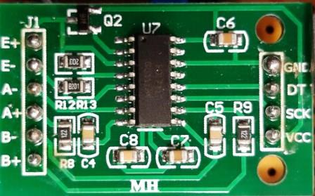
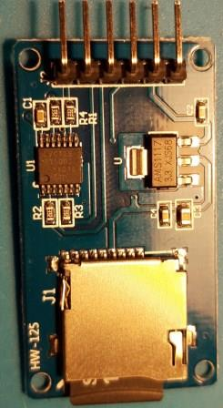
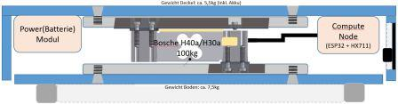

# BeeIoT v2.0
### Eine Bienenstockwaage im Eigenbau (mit IoT Technik)

##### 01.10.2019 by Randolph Esser

---
## Inhaltsverzeichnis:

- [Einführung](#einführung)
	* [Gewichtsschwankungen pro Tag](#gewichtsschwankungen-pro-tag)
	* [Gewichtsschwankung pro Jahr](#gewichtsschwankungen-pro-jahr)
	* [Ereignisse](#ereignisse)
- [Das Modul-Konzept](#das-modul-konzept)
- [IoT für Bienen](#iot-für-bienen)
- [Das finale BeeIoT Client Modul](#das-finale-beeiot-client-modul)
- [Die MCU Arduino/ESP32 Platform](#die-mcu-arduino-ESP32-platform)
	* [Das ESP32-DevKitC Board](#das-esp32-devkitc-board)
	 	+ [ESP32 DevKitC Sockel Belegung](#esp32-devkitc-sockel-belegung)
	 	+ [ESP32 GPIO Nutzung](#esp32-gpio-nutzung)
- [Die BeeIoT Sensorik](#die-beeiot-sensorik)
	* [Die Wägezellen Auswahl](#die-wägezellen-auswahl)
	* [AD Wandler HX711](#ad-wandler-hx711)
	* [Temperatursensoren](#temperatursensoren)
	* [LED-Status Anzeige](#led-status-anzeige)
	* [SPI Devices](#spi-devices)
		+ [Micro-SDCard Modul](#micro-sdcard-modul)
		+ [LoRa WAN Support](#lora-wan-support)
		+ [NarrowBand-IoT](#narrowband-iot)
		+ [RTC Uhrzeit-Modul](#rtc-uhrzeit-modul)
- [Power Management](#power-management)
	* [Externer USB Port](#externer-usb-port)
	* [Batterie/Akku](#batterie-akku)
	* [Power Monitoring](#power-monitoring)
	* [PV Solar-Modul](#pv-solar-modul)
	* [Alternativer Batterie Laderegler](#alternativer-batterie-laderegler)
- [Der Aufbau](#der-aufbau)
	* [Stückliste](#stückliste)
	* [Das Aussengehäuse](#das-aussengehäuse)
		+ [Die Bosche Wägezelle](#die-bosche-wägezelle)
		+ [Das Anschluss Panel](#das-anschluss-panel)
			+ [One Wire Sensoren](#one-wire-sonsoren)
			+ [Der DS18B20 OW-Temperatur-Sensor](#der-ds18b20-ow-temperatur-sensor)
	* [Compute Node Box](#compute-node-box)
	* [Steckverbinder](#steckverbinder)

- [Die ESP32 BeeIoT Sketch Software](#die-esp32-beeiot-sketch-software)
	* [ESP32 Vorbereitungen](#esp32-vorbereitungen)
	* [ESP32 IDE](#esp32-ide)
		+ [PlatformIO](#platformio)
		+ [ESP32 Sensor Libraries](esp32-sensor-libraries)

		+ [WLAN Konfiguration](#wlan-konfiguration)
		+ [Remote Konsole](#remote-konsole)
		+ [Samba Konfiguration](#samba-konfiguration)
	* [GPIO Programmierung](#gpio-programmierung)
	* [Raspi One-Wire Modul/DeviceTree](#raspi-one-wire-modul/device-tree)
		+ [Algorithmus: OneWire Protokoll DS1820](#algorithmus:-onewire-protokoll-ds1820)
	* [Algorithmus: A/D Wandler HX711 Protokoll](#algorithmus:-a/d-wandler-hx711-protokoll)
	* [Die Hauptprogrammstruktur](#die-hauptprogrammstruktur)
	* [Kalibrierung der Waage](#kalibrierung-der-waage)
	* [Restart via Crontab](#restart-via-crontab)
	* [Optional: WebUI Daten Service](#optional:-webui-daten-service)
- [WebUI ToDo - Liste](#webui-todo---liste)
- [Ideen Liste](#ideen-liste)
- [ToDo: Optional HW Module](#todo:-optional-hw-module)
	* [Nutzung einer SIM-Karte](#nutzung-einer-sim-karte)
- [Quellen/Links](#quellen/links)
	* [Marktübersicht professioneller Bienenstockwaagen](#marktübersicht-professioneller-bienenstockwaagen)
<!-- toc -->
---


## Einführung
Wie oft wünscht man sich als Imker, vor dem Standbesuch, zu wissen in welchem Zustand das Volk sich befindet, bevor man es öffnet. Dabei liegen die Vorteile auf der Hand:

+ Maßnahmen können vorher zeitlich eingeplant werden
+ Benötigtes Material kann für den Standbesuch vorbereitet werden
+ Die Behandlungszeit bei offener Beute kann ggfs. kürzer ausfallen, wenn sich die Mess-Annahme bestätigt

Interessante Parameter zum Bienen-Monitoring, die einem dabei behilflich sein können sind
+ **Der Beuten-Gewichtsverlauf**:
	- Honigverbrauch im Winter
	- Honigvorräte im Frühjahr (bis Trachtbeginn)
	- Anzeige von Honigverlust durch Räuberei in trachtarmer Zeit
	- Honigeintrag zur Haupt-Trachtzeit
	- Bedarf weiterer Honigräume
	- Zeitpunkt für Honigernte (Trachtende) bestimmen
+ **Die Stocktemperatur**
	- Temperaturverlauf im Bienenstock (Tag/Nacht) im Vergleich zur Aussentemperatur
		-> Anzeichen für die Aktivität des Volkes (besonders im Winter)
	- Beginn der Brutzeit durch Messung der Temperatur im Brutnest (>30° C)
	- Warnung bei Überhitzung des Bienenstocks (Gefahr für Brut und schweren Honigwaben)
	- Temperatur der Wintertraube (15-25 C) überwachen
	- Brutfreiheit für MS (Milchsäure) oder OS (Oxalsäure) Behandlung
+ **Fluglochaktivität** durch
	- Lichtschranke am Nesteingang
		+ Räubereialarm (Kämpfe am Nesteingang)
		+ Schwarmalarm bei viel Aktivität am Nesteingang in sehr kurzer Zeit (30Min.) 	 korrespondierend mit spontanem Gewichtsverlust (Delta: ca. 1,5 kg)
+ **Örtliche Wetterdaten**

Das Ziel wäre dann aus diesen Daten Schlussfolgerungen für den nächsten Standbesuch zu ziehen oder die Wirkung letzter Massnahmen zu verfolgen:
+ **Futterzustand** von Einwinterung E9 bis zur Auswinterung im Frühjahr A4
+ **Brut-Aktivität** durch ganzjährigen Temperaturverlauf im Bienenstock
	- Brutende zum Jahresende			-> Möglichkeit zur Varroabehandlung
	- Brutbeginn zum Jahresanfang 		-> "Bee-Alive" Status des Volkes
+ **Honigeintrag** und Trachtende zu den jeweiligen Trachtphasen
+ **Schwarmabgang** („bei dem Event weiss ich, ich war zu spät“)

Weitere optionale Sensor-Module:
+ Mit der *Infra-Rot Kamera* von außen auf die Gesamtbeute gerichtet:
  Liefert Hinweise auf den Bienensitz, und die Populationsaktivität im Winter
+ Mit dem *Fluglochzähler*: Flugaktivität am Flugloch

Um die anfallenden Sensordaten auswerten zu können muss ein gewisses *Referenz-Verhalten* an jedem Sensor angenommen werden um Abweichungen/Fehlmessungen zu erkennen (== Anomalie-Erkennung ==).
So gibt es allgemeine Gewichtsverläufe über das ganze Jahr hinweg, aber auch innerhalb eines Tages, die man recht gut bestimmten Volks-Zuständen zuordnen kann:

### Gewichtsschwankungen pro Tag
Hier nun ein idealisierter qualitativer Gewichtsverlauf eines sonnigen Sommertages (=Flugwetter):


Der Tag beginnt mit dem Ausflug der Bienen (ca. 1-2kg). Da eine Biene etwa 0.1 Gramm wiegt und ca. 10-15.000 Flugbienen möglich sind ergibt sich somit ein Delta von 1-1,5kg. Diese kehren in den folgenden Stunden immer wieder mit Honig, Pollen und Wasser zurück, so dass das Gewicht kontinuierlich steigt. 
Bis zum Sonnenuntergang ist die „Rückkehr“ der Sammlerinnen abgeschlossen und die Honigtrocknung durch die Stockbienen beginnt (begünstigt durch die kühleren Nachttemperaturen). 
Das Delta stellt den Tageseintrag dar.

### Gewichtsschwankung pro Jahr
Über das Jahr wirken die verschiedenen Maßnahmen an den Völkern auf die Gewichtskurve ein und lassen ggfs. Erfolg (z.B. Honigeintrag) oder Misserfolg (z.B. keine Futterannahme) kontrollieren.


Natürlich ist der Verlauf stark von den individuellen Behandlungs-Konzepten des Imkers abhängig, weshalb in den Stockwaagendiagrammen an jedem Änderungspunkt die entsprechende Massnahme markiert ist, um den Kurvenverlauf besser interpretieren zu können. So würde eine totale Brutentnahme im Sommer nach der letzten Schleuderung einen deutlich anderen Spätsommerverlauf haben; ebenso eine 3. Schleuderung bei Spättracht-Imkerei.

Spätestens bei der letzten Einfütterung und Einwinterung sind aber wieder alle Verläufe gleich zu erwarten.
Der tageweise Honigeintrag der Früh- und Sommertracht ist, wie aus dem oben dargestellten Tagesverlauf abgeleitet, durch den Treppenverlauf markant zu erkennen.

Ebenso auffällig sind die Ruhephasen eines Volkes nach/während der AS Behandlung. Diese werden aber teilweise durch die allgemeine Volksumstellung auf Winterbrut überlagert.

### Ereignisse
Sonderereignisse wie
+ Schwarmabgang
+ Schneefall
+ Plünderung/Diebstahl (:()
+ Ggfs. Räuberei

sind in Abweichung zu den erwarteten Referenzverläufen ebenfalls unter Berücksichtigung der akt. Wetterlage erkennbar.

In der Regel reicht die Stockwaage nur an einem Referenzvolk pro Standort um Globalereignisse wie der richtige Schleuderzeitpunkt für alle Völker am Trachtende zu ermitteln.

Im Weiteren stelle ich nun die Funktionen der Stockwaagemodule vor.

## Das Modul-Konzept
Dieser Aufbauvorschlag besteht im Kern als Mini-Compute Node aus einem Raspberry Pi für den Ablauf das Logger Programms, einer (!) Bosche Wägezelle zur Gewichtsmessung und diverse OneWire Sensoren für verschiedene Temperaturmessungen sowie weiterem Mess-Zubehör.

Der Compute Node wird über einen Mini-USB Port mit Strom versorgt und mit FW Updates versorgt.
Optional kann über ein LAN Kabel die Kommunikation betrieben werden und über POE (Power over Ethernet) eine weitere Stromquelle erschlossen werden.
Im weiteren kann die Kommunikation über die Protokolle WiFi, BLE, GPRS betrieben werden.

Als redundante Stromquelle zum USB Port dient eine Lithium-Batteriespeisung mit Aufladung einerseits über POE oder alternativ über ein externes PV Falt-Modul. Letzteres wird für mobileren Einsatz benötigt.

Die Messdaten werden über alle Sensoren erhoben, in Datentabellen auf der SD-Karte abgespeichert und per NB-IoT/WiFi per MQTT/FTP zur Darstellung und/oder Auswertung z.B. an eine extern hosted Web Page übertragen.
Parallel zu dieser externen Ablage stehen die Webpage files auch über den lokalen Webserver des Raspberry als Edge Server selbst zur Verfügung.
Neben der einfachen Messdatensammlung dienen diverse Algorithmen auf dem Edge Server zur Plausibilisierung der Messwerte und statistischer Aufbereitung für das Tages-, Wochen- und  Monats-Mittel, welche damit ebenfalls als Diagramm aufbereitet dargestellt werden können. Der ESP32 liefert "nur" die rohen Messwertdaten.


## IoT für Bienen
Der obige Fat-Client Ansatz dient als POC - ProofOfConcept für alle Sensor-Algorithmen und grundsätzliche (Ver-) Messbarkeit von Vorgängen in einer Bienenbeute.

Deutlich eleganter und damit skalierbarer ist der Modulstack im IoT Aufbau:


Die eigentliche Aufgabe der Sensorsteuerung und Roh-Messdatenaufnahme kann auch mit einer Arduino kompatiblen MCU (ESP32, XMC, ...) geleistet werden:

**Vorteil:**
+ geringerer Stromverbrauch pro Sensorclient Modul
+ geringere Invest-Kosten
+ übersichtlichere Programmstruktur durch entzerrten Modulstack
+ Skalierbarkeit durch standardisierte Schnittstellen 
	+ -> eine gesicherte Übertragung ist leichter realisierbar
+ Dadurch sind nahezu beliebig viele Sensor Clients in Reichweite verwaltbar.

**Nachteil:**
+ eine weitere Instanz zur Datenaufnahme
+ Mindestens 2 neue zu sichernde remote Kommunikationskanäle (NB-IOT/LTE + REST/Cloud service)
+ Dadurch höhere Kosten für mehr Remote Übertragungswege (-Verträge)

Grundsätzlich dient das Edge Device zur Registrierung und Kontaktierung der Sensor Clients via MQTT. Dabei findet eine  Konsolidierung der Rohdaten auf das wesentliche zur Übertragung an einen Cloud-/Web Service statt.
Erste Plausibilitätschecks und Tag-/Monat-/Jahres-Statistiken können ebenfalls erstellt werden.
Denn dafür reicht die Power eines Raspi Zero o.ä. bei Weitem.

Dies als Ausblick für die noch im Bau befindliche v2.0 Verion. Die Sensorlogik und Dateninterpretation zur Völksführung ist aber weitgehend synonym zur v1.x Version.


## Das finale BeeIoT Client Modul
Nachdem nun die funktionalen Anforderungen klarer umrissen sind, geht es an die Modulplanung:


Das vollständige Übersichtsbild der Stockwaagenmodule zeigt die Vielfalt der verwendeten Techniken, aber auch das Potential in Sachen Spannungsversorgung und Sensorik:

Folgende Funktionen wollen wir unterbringen:
+ Spannungsversorgung
	- Für das MCU Extension board:
		* Interner Lithium Akku (Laufzeit 6 Monate) mit Ladekontrollmodul (BMS)
	 	* über einen Spannungsanheber/Senker (BUKBooster) mit 5V zur internen USB Buchse der MCU
	 	* Akku von Extern ladbar via 5V USB Buchse, über die aber auch FW udate betrieben werden kann
	- PV Modulanschluss extern -> ebenfalls über den externen 5V USB Anschluss möglich zur Verlängerung der Akkulaufzeit
	- Optional: POE via RJ45 LAN-Hat mit POE/LAN Splitter
+ Kommunikation
	- Übertragung aller Sensordaten alle 10 Minuten um auch "Bienen-Events" mitzukriegen
	- lokal via externen USB auf internen USB/Ser. Adapter Port der MCU
	- WiFI support mit HTTP Web Service zur Startup Configuration
	- LoRaWAN Kommunikation mit Gateway (bis zu 7km Radius)
	- optional: Bluetooth (BLE)
	- Optional: NB-IOT via SIM7000E GPRS Modul
+ Sensorik
	- 100kg Wägezelle über einen 24bit A/D Wandler Modul HX711(am Raspi GPIO Port Anschluss)
	- OneWire Temperatur Sensor 12bit intern an der Wägezelle (zur temp. Kalibrierung)
	- OneWire Temperatursensor 12bit extern
	- OneWire Temperatursensor 12bit extern für Stocktemperatur Messung (über 1m Leitung)
+ Optionale Erweiterung
	- USB GPS Maus (als Diebstahlschutz)
	- IR Kameramodul extern (USB oder I2C Port Anschluss)
	- IR Lichtschranke als Fluglochzähler (beecounter)

Daraus ergeben sich spezielle technische Anforderungen an jedes modul bezüglich Stromverbrauch, benötigte Schnittstellen und lokale/remote Erreichbarkeit, die wir weiter unten noch zu diskutieren haben.

## Die MCU Arduino/ESP32 Platform
Um bis zu 6 Monat Laufzeit zu erreichen darf  man bei einem  10.000mAh Akku nur im Mittel 2.3mA verbrauchen (10.000/4320). Das schafft man bei so vielen Sensoren/Modulen aber nicht im Dauerlaufzustand, sondern nur indem man Sleep Phasen einschiebt.

*Dazu folgende Rechnung:*
Unter der Annahme man benötigt für die Ermittlung der Sensordaten inkl. Übertragung z.B 10 Sekunden,
Wäre das Verhältnis aktiver Betriebszeit zu Sleep Phase: 10/(6*30*24*60*60)=1/1.555.200.
Würde man in der SleepPhase aber unter 1mA kommen hätte man für die Betriebsphase über die gesamte Laufzeit noch zur Verfügung:
- Anteil Aktivphase: 10 Sek./10Minuten: 1/60
- auf 6 Monate entspricht das (6*30*24)h/60 = 72h = 3Tage Aktivphase
- => 4320-3 Tage Passivphase = 4317 Tage
- Stromverbrauch Passivphase: 4317 * 1mAh = 4317mAh von 10.000mAh.
- Möglicher **Stromverbrauch Aktivphase**: (10.000mAh - 4317mAh)/72h = 5683mAh / 72h = **~80mA**

Bezüglich Stromverbrauch kommt unterhalb des RaspberryPi Zero, der i.d.Regel >150mA liegt nur noch die Arduino Klasse in Frage, mit seinen bekannten Vertretern UNO 8266 und ESP32 von Espressif:

### Das ESP32-DevKitC Board
Als kompakteste MCU Variante mit sehr niedrigem Stromverbrauch, grosser Anzahl GPIO Ports  und weitverbreiteter Sensor-Unterstützung kommt hier der Arduino kompatible ESP32 in Form des ESP32-DevKitC zum Einsatz.

Der ESP32 unterstützt folgende APIs:
+  3x UART (RS232, RS485 und auch IrDA)
+  4x SPI (SPI0/1 for RD/WR flash Cache only; HSPI and VSPI free in Master/Slave Mode)
+  2x I2C (Std: 100 KBit/s und Fast-Mode (400 KBit/s))
	+ 2x GPIO ports - SW konfigurierte IO pins via *i2c_param_config()*
+  1x CAN Bus v2.0
+ 18x 12bit AD Converter
+  2x 8bit DA Converter
+  1x HW-PWM
+ 16x SW-PWM
+  1x IR Controller
+  4x 64bit Timer
+  1x int. HALL sensor
+  1x int. Temperatur Sensor (40-125 Grad F.)
+  Secure Boot Mode -> erlaubt das *Root of Trust* Konzept durch den "eFuse Speicher".

Zwar zeichnet sich ein Arduino 8266/UNO durch geringeren Stromverbrauch aus, der ESP32 hat aber mehr GPIO Leitungen, die wir dringend für alle verwendeten Module benötigen.

Allerdings kommt hier nicht die standardmäßig verbaute **Wroom32** Version des ESP32 zum Einsatz, sondern der **Wrover32**:

 ==> 

Das ergibt die genaue Modul-Bezeichnung: **ESP32-DevKitC-Wrover-B**.

Der **Wrover-B** hat neben dem 4MB Flash Memory auch noch einen zusätlichen 8-16MB PSRam Bereich, indem wir temporär anfallende residente Sensordaten ablegen/puffern können.
Ansonsten sind sie Pin- und Code-Kompatibel so dass grundsätzlich auch der Wroom verwendet werden kann. Die Nutzung des PSRam erörtern wir später.

Die Variante DevKit-C bringt bereits einige wichtige Betriebsfunktionen mit sich und ist durch ihr Standardsockelformat leichter auf ein 2,4" Lochrasterboard zu löten.
OnBoard findet sich auch bereits eine Bluetooth (4.2 + BLE) und WiFI (IEE 802.11 b/g/n) Unterstützung mit onboard Antenne. Zur Reichweitenvergrößerung ist bei manchen Ausführungen ein weiterer Antennen-Stecker vorhanden, an den eine zusätzliche externe WiFI Antenne angeschlossen werden kann.

#### ESP32 DevKitC Sockel Belegung
Zunächst das Standard-Pinning und die Default-Functional Overlays des DevKit C boards, wie sie durch den Microcode bei Power-ON voreingestellt sind:

|         |         |      |    |PIN|*|PIN|     |      |         |       |
|---------|---------|------|----|---|-|---|-----|------|---------|-------|
|         |         |      |3.3V|  1|*| 38|  GND|      |         |       |
|    SW2  |         |      |  EN|  2|*| 37| IO23|GPIO23|VSPI-MOSI|       |
| Sens-VP |ADC1-0   |GPIO36|  SP|  3|*| 36| IO22|GPIO22|I2C-SCL  | ->Wire|
| Sens-VN |ADC1-3   |GPIO39|  SN|  4|*| 35|  TXD|GPIO01|UART0-TXD| ->USB |
|         |ADC1-6   |GPIO34|IO34|  5|*| 34|  RXD|GPIO03|UART0-RXD| ->USB |
|         |ADC1-7   |GPIO35|IO05|  6|*| 33| IO21|GPIO21|I2C-SDA  | ->Wire|
|  XTAL32 |ADC1-4   |GPIO32|IO32|  7|*| 32|  GND|      |         |       |
|  XTAL32 |ADC1-5   |GPIO33|IO33|  8|*| 31| IO19|GPIO19|VSPI-MISO|       |
|    DAC1 |ADC2-8   |GPIO25|IO25|  9|*| 30| IO18|GPIO18|VSPI-SCK | U0-CTS|
|    DAC2 |ADC2-9   |GPIO26|IO26| 10|*| 29| IO05|GPIO05|VSPI-SS  |       |
|         |ADC2-7   |GPIO27|IO27| 11|*| 28| IO17|GPIO17|UART2-TXD|       |
|HSPI-SCK |ADC2-6   |GPIO14|IO14| 12|*| 27| IO16|GPIO16|UART2-RXD|       |
|HSPI-MISO|ADC2-5   |GPIO12|IO12| 13|*| 26| IO04|GPIO04|HSPI-4HD | ADC2-0|
|         |         |      | GND| 14|*| 25| IO00|GPIO00|  SW1    | ADC2-1|
|HSPI-MOSI|ADC2-4   |GPIO13|IO13| 15|*| 24| IO02|GPIO02|HSPI-4WP | ADC2-2|
|  U1-RXD |FLASH-D2 |GPIO09| SD2| 16|*| 23| IO15|GPIO15|HSPI-SS  | ADC2-3|
|  U1-TXD |FLASH-D3 |GPIO10| SD3| 17|*| 22|  SD1|GPIO08|FLASH D1 | U2-CTS|
|  U1-RTS |FLASH-CMD|GPIO11| CMD| 18|*| 21|  SD0|GPIO07|FLASH D0 | U2-RTS|
|         |         |  Vin | +5V| 19|*| 20|  CLK|GPIO06|FLASH CLK| U1-CTS|
**Pinning durch IDE board pre-selection = "esp32dev" für ESP32 DevKit-C boards **

Welche default Einstellung pro Board bei der IDE gilt kann man bei Platformio z.B. hier finden:
C:\Users\'benutzername'\.platformio\packages\framework-arduinoespressif32\variants\'boardtype'\pins_arduino.h

Als nächstes macht man sich auf die Suche nach geeigneten GPIO Control Leitungen, die mit ihren Eigenschaften der angeschlossenen Funktion für den Modulanschluss entsprechen müssen. Manche GPIO Leitungen sind, anders als bei einem reinen ESP32 Modul bereits durch onboard Funktionen des DevKitC Boards belegt. Dies muss aber kein Nachteil sein, weil die Funktionen ja auch benötigt werden:

Geflasht wird der ESP32 über die onboard USB-A Buchse die auch gleichzeitig zur 5V Stromversorgung des DevKitC Boards verwendet wird (standard). Onboard wird dann die 3.3V Leitung für die ESP32 MCU über einen internen DC/DC Wandler AMS1117-3.3 von Microship erzeugt, der max. 1A durchsetzen kann.
Zur USB/Ser.Kommunikation sind daher die Leitungen GPIO 1+3 (RX+TX)belegt.

Ein besonderes Augenmerk ist bei den Logikanschlüssen auf die richtige Logiklevel Nutzung bei unterschiedlich verwendeten Stromversorgungen der Sensormodule aufzubringen, wie sich später noch zeigen wird...(s. Micro SD-Card Modul)

**Hinweis: Der ESP32 selbst und alle GPIO-Anschlüsse arbeiten aber ausschliesslich mit 3.3V.**

Für den Flash-MM Anschluss werden GPIO6-11 onboard verwendet und stehen für unser Projekt daher nicht zur Verfügung. Auch die Leitungen EN(Boot-Button) und GPIO36(SP) + 39(SN) sind bereits belegt.
GPIO-00 wird per DevKitC FW als Reset Interrupt ausgewertet.

Über ein USB Kabel an einen Windows PC angeschlossen, zeigt sich der "Onboard USB to serial Converter" CP2102N im Windows Device Manager als:


Über dieses COM device ist er auch für IDEs wie die *Arduino-IDF* (https://github.com/espressif/esp-idf) oder *VC-Platform-IO* erreichbar. Eine COM Port Erkennung findet zumindest bei PlatformIO automatisch statt.

Auf einem Linux System nennt sich das USB Converter Device: */dev/ttyUSB0*.

Als Standard Baudrate sollte man es erstmal mit 115200 versuchen.
Der USB/UART Converter CP2102 schafft aber max. 921600 Baud rate.

#### ESP32 GPIO Nutzung
Und nun konkret die gewählte GPIO-Belegung der ESP32 DevKitC Sockel-Pins für das BeeIoT Projekt:
(gilt für WROOM32D alsauch Wrover-B Module)

|Pin| Ref. |  IO# |  DevKitC |       | Protocol |  Components    |
|---|------|------|----------|-------|----------|----------------|
|  1| +3.3V|      |          |       |    +3.3V | 3.3V           |
|  2|    EN|      |   SW2    |       |          | ePaper-Key2    |
|  3|*  SVP|GPIO36|  Sens-VP | ADC1-0|        - | x              |
|  4|*  SVN|GPIO39|  Sens-VN | ADC1-3|        - | x              |
|  5|* IO34|GPIO34|          | ADC1-6|          | ePD-K3/LoRa DIO2|
|  6|* IO35|GPIO35|          | ADC1-7|          | ePaper-Key4    |
|  7|  IO32|GPIO32|   XTAL32 | ADC1-4|OneWire-SD| DS18B20(3x)    |
|  8|  IO33|GPIO33|   XTAL32 | ADC1-5|          | LoRa DIO0      |
|  9|  IO25|GPIO25|     DAC1 | ADC2-8|  Wire-DT | HX711-DT       |
| 10|  IO26|GPIO26|     DAC2 | ADC2-9|  Wire-Clk| HX711-SCK      |
| 11|  IO27|GPIO27|          | ADC2-7| ADS-Alert| ADS1115/BMS    |
| 12|  IO14|GPIO14| HSPI-CLK | ADC2-6|Status-LED| LoRa RST       |
| 13|  IO12|GPIO12| HSPI-MISO| ADC2-5| SPI1-MISO| LoRa CS\       |
| 14|   GND|      |          |       |       GND| GND            |
| 15|  IO13|GPIO13| HSPI-MOSI| ADC2-4| SPI1-MOSI| LoRa DIO1      |
| 16|   SD2|GPIO09|FLASH-D2  | U1-RXD|        - | x              |
| 17|   SD3|GPIO10|FLASH-D3  | U1-TXD|        - | x              |
| 18|   CMD|GPIO11|FLASH-CMD | U1-RTS|        - | x              |
| 19|   +5V|      |          |       |  +5V_Ext | n.a            |
| 20|   CLK|GPIO06|FLASH-CLK | U1-CTS|        - | x              |
| 21|   SD0|GPIO07|FLASH-D0  | U2-RTS|        - | x              |
| 22|   SD1|GPIO08|FLASH-D1  | U2-CTS|        - | x              |
| 23|  IO15|GPIO15| HSPI-SS  | ADC2-3|MonLED-red| Red LED        |
| 24|  IO02|GPIO02| HSPI-4WP | ADC2-2|  SPI-CS  | SDcard CS\     |
| 25|  IO00|GPIO00|   SW1    | ADC2-1|          | ePaper-Key1    |
| 26|  IO04|GPIO04| HSPI-4HD | ADC2-0|      CLK | ePaper BUSY    |
| 27|  IO16|GPIO16|UART2-RXD |       |      DT  | ePaper RST     |
| 28|  IO17|GPIO17|UART2-TXD |       |          | ePaper D/C     |
| 29|  IO05|GPIO05| VSPI-SS  |       | SPI0-CS0 | ePD CS\        |
| 30|  IO18|GPIO18| VSPI-CLK |       | SPI0-Clk | ePD/SD/LoRa Clk|
| 31|  IO19|GPIO19| VSPI-MISO| U0-CTS| SPI0-MISO| SD/LoRa MISO   |
| 32|   GND|      |          |       |      GND | GND            |
| 33|  IO21|GPIO21| VSPI-4HD |       |  I2C-SDA | ADS1115/BMS    |
| 34|  RXD0|GPIO03|UART0-RX  | U0-RXD| -> USB   | USB intern     |
| 35|  TXD0|GPIO01|UART0-TX  | U0-TXD| -> USB   | USB intern     |
| 36|  IO22|GPIO22| VSPI-4WP | U0-RTS|  I2C-SCL | ADS1115/BMS    |
| 37|  IO23|GPIO23| VSPI-MOSI|       | SPI0-MOSI|ePD/SD/LoRa MOSI|
| 38|   GND|      |          |       |       GND| GND            |
(x unter components => darf nicht verwendet werden.)

Das MCU board erhält die 5V versorgung über den internen USB connector und erzeugt die 3.3V selbst.
Der 5V_Ext Anschluss wird nicht verwendet. Die 5V Leitung des MCU Extension Boards wird direkt von der Batterieversorgung gespeist.

Damit sind alle möglichen GPIO Leitungen funktionell belegt. Eine Erweiterung wäre nur noch über aufwendige IO port Multiplexer möglich. Die Auswahlkriterien werden weiter unten nochmal pro Sensor diskutiert.

## Die BeeIoT Sensorik
Als IoT Sensoren werden folgende Elemente und Anschlüsse verwendet:
+ 1x Wägezelle	-> über einen 24bit A/D Wandler HX711 an die GPIO Ports des ESP32 angeschlossen.
+ 3x Temperatursensoren zur Messung der (DS18B20 OneWire)
	- Intern: Stocktemperatur (innerhalb der Beute)
	- Externe Temperatur
	- Wägezellen Temperatur (ggfs. zur Kompensation einer Temperaturdrift)
	- => Alle Temp. Sensoren sind über das OneWire Protokoll direkt an einen GPIO Port des ESP32 angeschlossen.
+ 1x ADS1115 Messung des Batteriespannungspegel, Converter Ausgang (5V) sowie Ladespannung
+ 1x RTC Modul (I2C)(DS3231) incl. Eprom
+ 1x Micro SD Card Modul (SPI)
+ 1x ePaper 2.7" (SPI) + 4 F-Keys.
+ 1x LoRa MAC Modul (Dragino LoRa Bee 868MHz)
+ **Optional**
	- 1x xternes IR-Kameramodul -> für Bienensitz im Winter
	- NB-IoT Modul zur Funk-Fernübertragung via GPRS (SM7000E)
	- USB GPS Maus (mapped über ser. Port RX/TX)

### Die Wägezellen Auswahl
Eine Standardwägezelle mit geringer Temperaturdrift und hoher Gewichtsstabilität sowie Messwiederholgenauigkeit weist heutzutage typischerweise vorkalibrierte Dehnmesstreifen in einer Wheatstonebrücke verschaltet auf. Diese ist eine gegenläufige Verschaltung von 4 Dehnmessstreifen (DMS) im Rautenmodell (siehe Schaltbild weiter unten) incl. Temperaturdriftkompensation.

Meine Auswahl fiel (wie bei so manchen anderen Waagen-Projekte im Netz auch) auf den Hersteller Bosche. Die Wägezelle muss folgenden Anforderungen entsprechen:
+ Messbereich 100Kg (Waagendeckel + Beute (2 Brut- und 2 Honig-Zargen) + Deckel und Abdeckgewicht.
+ Stabile Verschraubung mit dem Waagendeckel zur Kraftübertragung möglich (für Zander: 40 x 50cm) Unterboden
+ Dadurch geringe Eckgewichtslast-Fehler
+ Spannungsversorgung ab 5V (aus Raspi Versorgungsspannung)
+ Großer Temperaturmessbereich -30 … +50 Grad
+ bei vorgegebener Genauigkeit: Class C3: 2mV/V
	- Bei  5V Messzellenspannung ergibt das eine Messabweichung von
(100kg/5V)*2mV => +/- 40Gramm
+ Wasserfestigkeit IP65 (spritzwassergeschützt)

Daher fiel die Wahl auf die: **Bosche H40A Wägezelle** :

mit den Eigenschaften
+ Nennlast 100 kg
+ Kompensierte Eckenlastfehler
+ Für Dauereinsatz geeignet
+ Bezug direkt über den Bosche Shop: http://www.bosche.eu
+ Material: Aluminium
+ Genauigkeitsklasse bis C4 (C3 Standard, C4 auf Anfrage), Y=15.000, Nennwert-Toleranz: 2,0 mV/V
+ Eichfähig nach OIML R60 bis 4000D, Prüfscheinnummer: DK0199-R60-12.19
+ Aufbau: Das Messelement ist vergossen, Schutzklasse: IP65
+ Max. Plattformgröße: 500 x 500 mm
+ Stromversorgung: 5 – 12V
+ Temperarturbereich: - 30 ... + 70 °C
+ Anschluskabel: 1,8m
+ Preis: 58€

Anfangs habe ich mit dieser wesentlich günstigeren Wägezelle gestartet: --YZC161E-- (ca. 4,50€/Zelle)
Durch den Aufbau bedingt verkraftet diese Zelle aber nur 50Kg pro Zelle und ist baulich als Auflagesensor gedacht. Daher werden 4 Stück an jeder Ecke benötigt, die als Wheatstone-Brücke verschaltet werden müssen.

Wie aus dem unteren Bild (linke Hälfte) aber ersichtlich weisen die Auflagepunkte eine Reibung auf (je mehr Gewicht desto höher), die bei einer horizontalen Temperatur-Ausgleichsbewegung der Stabilisierungsträger Verspannungen hervorruft, und somit die Messzelle und damit die DMS vorspannt und zu starken Messfehlern führt.
Besonders unangenehm ist das „Springen“ der Auflage über den Messzellenauflagepunkt ab Überschreitung einer max. Dehnungs-Spannung, was wiederum zu Messwertsprüngen führt. Diese lassen sich auch über eine Messzellen-Temperaturmessung oder algorithmisch nicht mehr verlässlich kompensieren.
Diese Wägezelle eignet sich vorrangig für Körperwaagen, wo i.d.R. nur spontane Einzel-Messungen mit Rücksprung auf das Null-Gewichtslevel erfolgen. Für konstante Dauermessungen auf höherem Gewichtsniveau eignen sie sich nach meinen Erfahrungen nicht.


Daher habe ich diese zwar günstige aber aufwändig installierbare und nicht kalibrierbare Variante wieder verworfen.

Die Anbindung der **Bosche Wägezelle H40A** an den ESP32 erfolgt über das 24bit A/D-Wandler Modul ‘HX711‘. Dieses wurde speziell für Wägezellen mit Wheatstone-Brücke konzipiert und weisst eine einstellbare Verstärkung und integrierte Referenz-Spannungsversorgung auf.
Beim Kauf ist darauf zu achten, dass die Module an den Anschlüssen E- bzw. BLK mit GND verbunden sind, was sich sonst in einer geringeren Temperaturstabilität und Meßstreuung auswirkt. Im Zweifel muss die Draht-Brücke selbst durch einen externen Draht nachgearbeitet werden.
Module mit grüner Schutzfarbe sind aber i.d.R. richtig beschaltet.
Desweitern werden die Wägezellen durch ihre Anzahl an Dehnmessstreifen (DMS) mit einer Wheatstonebrücke versehen. Ein DMS wandelt eine Gewichtsbelastung an einer Körperoberfläche in Widerstandsänderungen der Größenordnung Faktor 0,0001 – 0,001 eines Referenzwertes (hier ca. 400 Ohm) um. Diese sehr geringe Änderung ist durch eine Messbrücke nach Wheatstone zu vermessen, welche durch ihre gegenläufigen Widerstandspaare temperaturstabilisierend und messverstärkend wirkt.

In der Bosche H40A sind die DMS derart verschaltet, dass das Ausgangssignal direkt auf den A/D Wandler HX711 geführt werden kann, was den Aufbau stark vereinfacht.

### AD Wandler HX711
Der AD Wandler HX711 ist für die Messung von Wheastonebrücken optimiert und bietet dazu 4 Anschlüsse E+/- + A+/-. An den Pins B+/B- liegt die Messspannung für die Waagzellenbrücke an.
In unserem Fall ist es die 3.3V Linie von der ESP32 MCU kommend. Die 5V Versorgung, welche aufgrund des weiteren Spannungsfensters einen geringeren Messfehler liefern würde, kann leider nicht genommen werden, da die zugehörigen Logikleitungen nur 3.3V aufweisen dürfen.

Hier könnte man ggfs. mit einem weiteren 5V <-> 3.3V Logikconverter optimieren.

Auf der rechten Seite befinden sich 4 Anschlüsse zur digitalen Anbindung an die GPIO Ports des ESP32:



Die Eigenschaften des HX711:
+ 2 wählbare Eingänge zur Differenzmessung
+ Eine On-chip active rauscharme Steuereinheit mit wählbarer Verstärkung (32, 64 und 128)
+ On-chip Stromversorgungskontrolle für die Waagzelle
+ On-chip Rest nach Einschaltung
+ Einfache digitale Anbindung
+ Wählbare Samplegeschwindigkeit (10SPS oder 80SPS)
+ Stromsparregler: normaler Betrieb < 1.5mA, Off Mode < 1uA
+ Spannungsversorgungsbereich: 2.6 - 5.5V mit enstellbarer Verstärkung
+ Temperaturbereich: -40 - +85?

Für Kanal A kann eine Verstärkung von 128 oder 64 gewählt werden, Kanal B bietet eine fixe Verstärkung von Faktor 32. Daher habe ich für diese Version nur den Port A mit GAIN 128 verwendet und Port B stillgelegt.
Zum Anschluss der HX711 Logik-Ports an den ESP32 werden nur 2 der generischen duplex-fähigen GPIO Ports benötigt 
(Data + SCK):
```
#define HX711_DT    25    // serial dataline
#define HX711_SCK   26    // Serial clock line
```
Zur Stabilisierung und Entstörung der Stromversorgungsleitungen (3.3V & 5V) werden je 1x 100nF Siebkondensatoren sowie je ein 4,7uF Puffer-Elko verwendet.
Zur Abwägung dieses Stabilisierungsaufwandes dient folgende Genauigkeitsbetrachtung:

+ Gegeben: Speisespannung der Wheatstonebrücke von 3.3 Volt und einer Nennwert-Toleranz von 2mV/V (Class C3)
+ Bei 5V Messzellenspannung ergibt das eine **Messabweichung** von (100kg/3.3V) x 2mV/V => **+/- 60 Gramm**
+ Das ergibt eine **Empfindlichkeit** von 3.3V x 2mV/100kg = **66µV/kg = 66nV/Gr**
+ Als default verstärkung (GAIN) wird 128 angenommen.

Der verwendete A/D Wandler hat aber eine maximale Spannungsauflösung/bit von 128 x 3.3V/2hoch24 =**~1,5 nV** bei einer Vertärkung von 128 an Port A. Dies ergibt den Wert von 66nV/Gr / 1,5nV = **44**/Gramm.
Als 1Kg-Scale-Divider müsste man im Programm also später den Wert **44000/kg** ansetzen. Der Scale Offset Wert muss durch die Vermessung des äußeren Aufbaus (Deckel) erst ermittelt werden.

Der HX711 ist mit 24bit Genauigkeit auch an nur 3.3V also mehr als hinreichend ausgelegt. Diese Genauigkeit Bedarf aber einer gut stabilisierten Betriebsspannung.
Die Streuung um die 3.3V Stromversorgung bestimmt also direkt die Qualität/Streuung der Messwerte.
Der daraus resultierende Messfehler durch die Streuung kann aber über Mittlung von mehreren (~10-20) Messwerten deutlich verringert werden und damit den Vertrauensbereich deutlich erhöhen.

Im Arduino Sketch ist der HX711 Anschluss wie folgt definiert:
```
// Library fo HX711 Access
#include <HX711.h>

// HX711 ADC GPIO Port to Espressif 32 board
#define HX711_DT    25    // serial dataline
#define HX711_SCK   26    // Serial clock line
#define scale_DIVIDER 44000   // Kilo unit value (2mV/V, GAIN=128 Vdd=3.3V)
#define scale_OFFSET 243000   // 243000 = 44000 * 5.523kg (of the cover weight)
```

### Temperatursensoren
Für den Anschluss von mehreren Messeinheiten über einen (3-pol.) Eingangsport bietet sich das serielle OneWire Protokoll an. Dafür steht eine große Palette an günstigen (Temperatur-)Sensoren zur Auswahl.

Für die benötigte Genauigkeit der Temperaturmessung (9-12bit) wird der Sensor DS18B20 von Dallas verwendet, den es in der Bauform als 1,8m langes Versorgungskabel (3-pol.) und IP67 Abdichtung mit einer robusten Aluminium-Messspitze als Messsonde gibt.

Wie aus dem Bild ersichtlich, werden einfach alle OneWire Sensoren mit ihren 3 pol. Leitung parallel angeschlossen (es sind bis zu 10 Sensoren möglich). Zur Pullup-Versorgung der Datenleitung ist ein Widerstand von 4.7k Ohm gegen 3.3V einmalig für alle angeschlossenen Sensoren nötig, da alle Sensoren alsauch der ESP32 GPIO port mit OpenCollector Treibern arbeiten. der Pullup schafft damit einen definierten Logikpegel.


Im Arduino Sketch finden sich dazu folgende Einstellungen:
```
#include "OneWire.h"
	#include "DallasTemperature.h"
	// Data wire is connected to ESP32 GPIO 32
	#define ONE_WIRE_BUS 32
```


### LED-Status Anzeige
Zur Anzeige des Betriebszustandes dient eine rote LED am rückseitigen externen Anschlusspanel.

Diese wird über einen GPIO Port getrennt angesteuert und zeigt durch Blinkcodes verschiedene Programm- Zustände (Setup / Loop / Wait)an.

```
#define LED_RED     15    // GPIO number of red LED
// reused by BEE_RST: Green LED not used anymore
//#define LED_GREEN   14    // GPIO number of green LED
```
Die aufgeführte grüne LED hatte ursprünglich die Funktion als weitere Statusanzeige musste aber mangels freier GPIO ports und Stromsparzwecken eingespart werden.

### SPI Devices
Grundsätzlich bietet der ESP32 2 unabhängige SPI ports (VSPI & HSPI) für den Anwender extern an, die per default unter folgenden GPIO Ports (definiert über Arduino.h) erreichbar sind:
```
// ESP32 default SPI ports:
#define VSPI_MISO   MISO  // PIN_NUM_MISO    = 19
#define VSPI_MOSI   MOSI  // PIN_NUM_MOSI    = 23
#define VSPI_SCK    SCK   // PIN_NUM_CLK     = 18
#define VSPI_CS     SS    // PIN_NUM_CS      = 5

#define HSPI_MISO   12    // PIN_NUM_MISO
#define HSPI_MOSI   13    // PIN_NUM_MOSI
#define HSPI_SCK    14    // PIN_NUM_CLK
#define HSPI_CS     15    // PIN_NUM_CS
```
Die Kurzbezeichnungen MISO, MOSI, SCK und SS stammen von der Arduino IDE via Arduino.h und definieren damit den default SPI port, wenn man keine weiteren GPIO Angaben in der Initialisierungsfunktion eines jeden SPI devices macht. (Die tatsächlichen GPIO Werte finden sich im Kommentar)

Zur Einsparung von GPIO Ports habe ich alle 3 verwendeten SPI devices (ePaper, SDCardModul und LoRa Bee) über VSPI angeschlossen.
Während die Leitungen MOSI, MISO und SCk zwischen allen Devices geshared werden (Parallel-Anschluss),
benötigt jedes device mindestens seine eigene CS\ Leitung zum Start der individuellen Protokollfensters.
Um Störung in der Startupphase des setup zu vermeiden werden zu Anfangs in der Setup routine alle CS\ Leitungen der 3 Devices auf inaktiv (High) vordefiniert. Das beugt Störungen bei der weiteren sequentiellen Inbetriebnahme der damit inaktiven SPI Modul Schnittstellen vor.

#### Micro-SDCard Modul
Die Verwendung einer SD Karte ermöglicht einerseits die dauerhafte Ablage großer Mengen an Sensordaten vor dem Versand oder auch als Backup space, wenn keine Konnektivität besteht. 
Anderseits kann im Notfall der komplette Datensatz auch manuell am Laptop ausgelesen werden.

 

Dieses weitläufig verfügbare Modul enthält einen 3.3V <-> 5V level changer onboard und ermöglicht dadurch eine Vdd Spannung von 3.3V - 5V mit Logikleitungen auf 3.3V.
Beim Anschluss weiterer SPI Devices stellte sich aber heraus, dass der 3.3V Logiklevel nicht immer sauber eingehalten wird (speziell nach einem Reset). Vdd = 3.3V löste das Problem wieder. 
Dadurch wird allerdings der 5V -> 3.3V Spannungswandler auf dem DevKitC Modul stärker belastet. (Die möglichen 1 A werden wir aber natürlich nicht erreichen.)

Die GPIO Port Definitionen:
```
#include <SPI.h>	// default for all SPI devices
// Libraries for SD card at ESP32:
#include "SD.h"
// ...has support for FAT32 support with long filenames
#include "FS.h"

#define SD_MISO     MISO  // SPI MISO -> VSPI = 19 shared with ePD & LoRa Bee
#define SD_MOSI     MOSI  // SPI MOSI -> VSPI = 23 shared with ePD & LoRa Bee
#define SD_SCK      SCK   // SPI SCLK -> VSPI = 18 shared with ePD & LoRa Bee
#define SD_CS       2     // SD card CS\ line - arbitrary selection !
#define SPISPEED 2000000  //20MHz clock speed
```
Über Nutzung von FS.h ist auch der Betrieb mit long filenames bei größeren Karten möglich.
Dieses Modul unterstützt 2GB - 16GB Micro SD Cards, vorformatiert(!) mit FAT32 Format.

Dieses Modul wäre aber auch ein Kandidat zur EInsparung wenn wir wieter den Strombedarf reduzieren wollen.

#### E-Paper Display
Zur stromsparenden Darstellung der aktuellen Zustands- und Mess-Werte musste ein Display her.
Dadurch sieht man wesentliche Werte und aktuelle massnahmen gleich vorort und nicht nur über eine Webseite remote.

Als Kriterien sollen gelten:
+ Stromsparend auch in der Wait-Loop Phase zwischen den Messungen
+ Gute Ablesbarkeit durch hohen Kontrast auch bei direkter Sonneneinstrahlung
+ Einfacher Anschluss an bestehende ESP32 Interface-Pegel: 3.3V
+ Einfache Ansteuerung und Kontrolle der Darstellung.

Zumindest die ersten 3 Punkte konnte ich durch das ePaper von WaveShare erfüllen:
+ Waveshare 2.7 Inch E-Paper Display HAT Module Kit 264x176 Resolution
+ 3.3v E-ink Electronic Paper Screen with Embedded Controller
+ for ESP32 SPI Interface

Ein Stromverbrauch entsteht nur in der Initialisierungs- und Ladephase der Darstellungsdaten. 
Größter Vorteil ist aber das passive Darstellungsmedium: ePaper, welches auch bei direkter Sonne wie ein gedrucktes Papier erscheint. Das erhöht die Lesbarkeit im Outdoor-Einsatz enorm.
Ein LCD Display müsste hier nachgesteuert werden und muss dazu dauerhaft mit Strom versorgt werden.
Hat allerdings den Vorteil der möglichen Beleuchtung bei Dämmerung/Dunkelheit. 
Allerdings mal ehrlich: wer imkert dann noch ???

Daher hat ein EPaper i.d.R. auch keine Hintergrundbeleuchtung. Dieses Modul weißt neben dem eigentlichen Display dafür noch 4 universelle Schalter zur späteren funktionellen Erweiterung von z.B. verschiedenen Darstellungsebenen auf. Dazu später mehr...


Ursprünglich stellt dieses Modul einen RaspberryPi Hat dar und hat daher auch eine 40-pol. Buchsenleiste kompatibel zum RPi. Für unsere Zwecke verwenden wir den parallelen Kabelanschluss.
mit einem separaten SPI Interface über einen 8poligen Stecker incl Kabel:


Die Anschlussbelegung des SPI Kabelanschlusses:

|Pin |Farbe  |Function|
|----|-------|--------|
|VCC |rot	 |3.3V/5V |
|GND |schwarz|Ground  |
|DIN |blau	 |SPI MOSI pin|
|CLK |gelb	 |SPI SCK pin|
|CS  |orange |SPI Chip Selection, low active|
|DC  |grün   |Data(=1) / Command(=0) selector|
|RST |weiss  |Reset, low active|
|BUSY|lila   |Busy status output, low active|

Den passenden und umfangreichen DemoCode von WaveShare für RaspberryPi in C++ findet man **[hier](https://www.waveshare.com/wiki/File:2.7inch-e-paper-hat-code.7z)**.

Die GPIO Belegung ist atürlich in den leitungen MISO, MOSI und SCK identisch zu SDCard und LoRa Bee.
neben der eigene CS Leitung gibt es noch einen Reset udn einen BUSY "Draht".
Über BUSY kann man den Upload prozess neuer Display Daten pollen. Deklariert man diese GPIO Leitung im Interrupt mode kann eine asynchrone Bedienung über eine ISR (Int. Service routine) implementiert werden. da wir aber eh '10Min.-10Sekunden' lang nichts besseres zu tun haben, reicht das sequentielle Polling.

```
// WavePaper ePaper port
// mapping suggestion for ESP32 DevKit or LOLIN32, see .../variants/.../pins_arduino.h for your board
// Default: BUSY -> 4,       RST -> 16, 	  DC  -> 17, 	CS -> SS(5), 
// 			CLK  -> SCK(18), DIN -> MOSI(23), GND -> GND, 3.3V -> 3.3V
#define EPD_MISO VSPI_MISO 	// SPI MISO -> VSPI
#define EPD_MOSI VSPI_MOSI 	// SPI MOSI -> VSPI
#define EPD_SCK  VSPI_SCK  	// SPI SCLK -> VSPI
#define EPD_CS       5     	// SPI SS   -> VSPI
#define EPD_DC      17     	// arbitrary selection of DC   > def: 17
#define EPD_RST     16     	// arbitrary selection of RST  > def: 16
#define EPD_BUSY     4     	// arbitrary selection of BUSY > def:  4  -> if 35 -> RD only GPIO !
#define EPD_KEY1     0     	// via 40-pin RPi slot at ePaper Pin29 (P5)
#define EPD_KEY2    EN     	// via 40-pin RPi slot at ePaper Pin31 (P6)
#define EPD_KEY3    34     	// via 40-pin RPi slot at ePaper Pin33 (P13)
#define EPD_KEY4    35     	// via 40-pin RPi slot at ePaper Pin35 (P19)
```

Wie oben erwähnt fällt die Bedienung aber etwas aufwändiger aus, denn neben dem SPI API sind dann diverse Font Libs, und ggfs. BitMaps zu laden.
Aktuell verwende ich die Library: https://github.com/ZinggJM/GxEPD
mit dem für mein ePaper device spezifische Extension: GxGDEW027C44.h 
```
// Libs for WaveShare ePaper 2.7 inch r/w/b Pinning GxGDEW027C44
#include <GxEPD.h>
#include <GxGDEW027C44/GxGDEW027C44.h>  // 2.7" b/w/r
#include <GxIO/GxIO_SPI/GxIO_SPI.cpp>
#include <GxIO/GxIO.cpp>

// FreeFonts from Adafruit_GFX
#include <Fonts/FreeMonoBold9pt7b.h>
#include <Fonts/FreeMonoBold12pt7b.h>
#include <Fonts/FreeMonoBold18pt7b.h>
#include <Fonts/FreeMonoBold24pt7b.h>
#include <Fonts/FreeSansBold24pt7b.h>
#include "BitmapWaveShare.h"

#define HAS_RED_COLOR     // as defined in GxGDEW027C44.h: GxEPD_WIDTH, GxEPD_HEIGHT
```

Als weiteres Gimmick unterstützt dieses ePaper von Waveshare auch die Farbe rot. Wie sich bei der Anwendung aber herausstellte, verlängert das die eh schon mit >10 Sek. recht lange Display-Update Zeiten nochmal zusätzlich. **Hier ist eine Optimierung zur Stromeinsparung noch zu implementieren**.


Ist da Display einmal aktualisiert, ud die BUSY Leitung lässt uns "weiter arbeiten/schlafen", liegt der Stromverbrauch aber nahezu bei 0mA.

#### LoRa WAN Support
Für die remote Connection ohne "stromfressenden" WiFi Betrieb oder nicht-erreichbarem Hotspot, ist ein LoRa Funktmodul vorgesehen. Auf 868MHz voreingestellt kann es abhängig von der räumlichen topologie Reichweiten bis zu 8km ermöglichen.

Das LoRa Protokoll ist auf geringe Band-Belastung und geringem Stromverbrauch ausgelegt.

Das verbaute Funkmodul bietet erstmal nur den LoRa-MAC layer Übertragungssupport. Den Rest für das **[LoRaWAN Protokoll](https://lora-alliance.org/about-lorawan)** leisten die dazugehörigen Bibliotheken.
Darin sind dann eine Peer2Peer Verbindung über unique Sender/Empfänger IDs und Verschlüsselungs-keys ähnlich wie bei TCP/IP kombinirt mit SSH enthalten.
Als Gegenstück ist ein RaspberryPi basierter Gateway vorgesehen, der seinerseits wieder die benötigte WiFi/LAN Anbidnung hat um die gewonnenen Daten zu validieren und auf eine Website zu spiegeln.

Aktuell befinden sich der Code dazu mangels vollwertigem Gateway noch im Beta-Stadium (!).
Ein interessanter Client sample Code findet sich über eine Beispielprojekt des Opennet teams:
https://wiki.opennet-initiative.de/wiki/LoRaSensor


Hauptanbieter des LoRa-MAC Layer Moduls ist die Firma Semtech, die auch die **[LoRaWAN Spezifikation v1.0.3](https://lora-alliance.org/resource-hub/lorawanr-specification-v103)** als Member der "LoRA Alliance" mitherausgegeben hat. 
Die Firma Dragino hat auf Basis dieses Quasi-Standard Modules (basierend auf dem SX1276/SX1278 transceiver chips) diverse Hats & Shields entworfen. 
Der kleinste Vertreter davon (ohne GPS Modul) ist das "Dragino Lora-Bee Modul" **[(Wiki)](http://wiki.dragino.com/index.php?title=Lora_BEE)**, welches via SPI angeschlossen wird.
Darauf befindet sich ein RFII95-98W mit SPI Interface.
Zusätzlich gibt es noch eine Reset leitung (RST) und 6 universelle IO Leitungen für weitere Funktionen DIO0..DIO5. DIO0 bildet z.B. den LoRa Interrupt ab und triggert bei Events wie z.B. eingetroffene Pakete usw. Für den STd. LoRa Betrieb werden die übrigen DIO1-DIO5 Leitung aber nicht benötigt.
Daher habe ich in dieser Schaltung nur DIO0 + DIO1 auf duplex fähige GPIO Leitungen gemapped, und DIO2 auf eine Reda Only Leitung (weil sie noch frei war, aber geshared mit dem Key3 des ePaper moduls; aber aktuell ohne Funktion bleibt). Ggfs. kann man darüber noch einen manuellen Sendetrigger imlementieren.

 

Auf dem 2. Bild ist das grün gefärbte Semtech LoRa Modul gut zu erkennen.

Die Spezifikation weisst folgende Eigenschaften aus:
- 168 dB maximum link budget.
- +20 dBm - 100 mW constant RF output vs.
- +14 dBm high efficiency PA.
- Programmable bit rate up to 300 kbps.
- High sensitivity: down to -148 dBm.
- Bullet-proof front end: IIP3 = -12.5 dBm.
- Excellent blocking immunity.
- Low RX current of 10.3 mA, 200 nA register retention.
- Fully integrated synthesizer with a resolution of 61 Hz.
- FSK, GFSK, MSK, GMSK, LoRaTM and OOK modulation.
- Built-in bit synchronizer for clock recovery.
- Preamble detection.
- 127 dB Dynamic Range RSSI.
- Automatic RF Sense and CAD with ultra-fast AFC.
- Packet engine up to 256 bytes with CRC.
- Built-in temperature sensor and low battery indicator.

Das Dragino Manual dazu findet sich **[hier](http://wiki.dragino.com/index.php?title=Lora_BEE)**.


Da aber nahezu alle Leitungen des SemTech Moduls 1.1 am Bee-Sockel ausgeführt sind, kann man im Grunde jede Bibliothek verwenden, die den SX1276 (für 868MHz) unterstützt.

Die aktuell verwendeten GPIO Port Definitionen:
```
#include <SPI.h>	// default for all SPI devices
// Libraries for LoRa
#include "LoRa.h"

// LoRa-Bee Board at VSPI port
#define BEE_MISO VSPI_MISO	// SPI MISO -> VSPI
#define BEE_MOSI VSPI_MOSI	// SPI MOSI -> VSPI
#define BEE_SCK  VSPI_SCK	// SPI SCLK -> VSPI
#define BEE_CS   	12		// NSS == CS
#define BEE_RST		14  	// Reset\
#define BEE_DIO0	33		// Main Lora_Interrupt line
#define BEE_DIO1	13		// for Bee-Events
#define BEE_DIO2	34		// unused by BEE_Lora;  connected to EPD K3 -> but is a RD only GPIO !
```
Die Rolle des Client Node MAC layers ist in dieser **[Backend Specification](https://lora-alliance.org/resource-hub/lorawanr-back-end-interfaces-v10)** festgehalten
Aktuell gehen meine Tests in Richtung des LMIC LoRaWAN SW Stack Implementierung von IBM.
GitHub -> "lmic_pi".

Für MAC Layer Testzwecke habe ich im Sketch aktuell nur die Lora-Library von Sandeep (GitHub) in Verwendung. Bevor keine stabile MAC Layer Kommunikation betseht braucht man über eine WAN Kommunikation 'noch' nicht zu kümmern.

Da ich ein eigens LoRaWAN Netzwerk aufbauen möchte ist die Rolle dieses nodes: Activation-by-Personalization (ABP) und als eindeutige LoRa Devide-ID habe ich daher die ESP32 interne BoardID (basierend auf der WiFi MAC Adresse) vorgesehen. Daraus kann auch die LoRa-"DevAddr" zur Node-Protokoll ID gebildet werden.
Eine Anbindung an das allseits beliebte offene TT-Netzwerk schränkt die Nutzung durch limitierte Anzahl Daten und Paket/Zeitraum zu sehr ein.
Als Advanced feature ist OTAA anzusehen. Der standardisierte Weg über LoRaWAn FW updates remote auf den ESP32 als Lora Node aufzuspielen. Damit ist echte Fernwartung möglich, (wie sonst nur bei einer echten LAN Verbindung und laufendem OS auf dem Node wie bei einem RPi.)

### NarrowBand-IoT
NearBand-IoT ist grundsätzlich eine LTE basierte Kommunikation mit SIM Karte und Provider, wie bei jedem Mobile auch. NB-IoT verwendet aber zusätzlich die niederfrequenten ANteil und erreicht damit eine bessere Durchdringung von Gebäuden. Ein Client im 3. Stock einer TG soll damit problemlos möglich sein, was für die meisten Smart-Home Anwendung aureichend sein sollte.

Als Sender mit einem SIM Kartenleser Modul habe ich mir den häufig verwendeten und Library seitig gut unterstützten SIM700E mit GPS Maus (optional) support ausgesucht.

Leider benötigt es als echtes SIM Modem eine serielle RX/TX ANbindung, wofür weitere 2 GPIO Leitung benötigt werden. da diese aktuelle nicht frei sind, bleibt es erstmal bei der LoRaWan Anbindung.

Das von mir bestellte Modul: 
Waveshare NB-IoT eMTC Edge GPRS GNSS Hat incl. Antenne
+ mit Breakout UART control pins (Baudrate: 300bps~3686400bps)
+ Control via AT commands (3GPP TS 27.007, 27.005, and SIMCOM enhanced AT Commands)
+ Supports SIM application toolkit: SAT Class 3, GSM 11.14 Release 98, USAT


=> Link zum **[SIM7000E-HAT Wiki](https://www.waveshare.com/wiki/SIM7000E_NB-IoT_HAT?Amazon)**

Verwendet folgende ESP32 Anschluss pins:
+ TXD0: Optional
+ RXD0: Optional

=> bis jetzt nicht implementiert !

### RTC Uhrzeit-Modul
Für eine gutes Monitoring und auch für die LoRaWAn Kommunikation ist stets die genaue Uhrzeit zur Synchronisation der Datenpakete nötig.

Für eine genaue Uhrzeit kommen 2 Quellen in Frage:
- Befragung eines NTP Servers via WiFI Anbindung, oder
- via localem RTC Module

Beide sind im Sketch implementiert und redundant zueinander verschaltet:
Betshet keine WiFi Verbindung wird das RTC Modul direkt befragt. betshet eine WiFi Verbindung wird Kontakt zu einem NTP Server aufgenommen und das klokale RTC Modul neu mit der NTP Zeit synchronisiert.
darüber halten wir stets eine hinreichend genaue Uhrzeit vor.


Dieses RTC Modul mit DS3231 chip enthält neben einem sehr genauen uhrzeitmodul auch ein internes EEPROM zur residenten Ablage von Betriebsdaten im Sleep Mode. Dies ist eine zusätzliche Alternative zur ESP NVRAM area oder gar der SDCard. Weitere test müssen noch heruasarbeiten welcher Weg den geringeren Stromverbrauch bei hinreichender Speichergröße für die Sleep Mode Housekeeping Daten darstellt. Auch ist die Häufigkeit der Widerbeschreibbarkeit ein Thema, da der Sleep Mode alle 10-Minuten gestartet wird.

Dieses EEPROM 2432 ist mit einer eigenen Stromversorgung über ein 3V onboard Lithium-Akku (LIR-2032/3.6V)gepuffert.
Alternativ kann der Li-Akku auch durch eine normale 3V Li Zelle (CR2032 oder CR2016) ersetzt werden, dann aber mit endlicher Laufzeit. Eine "LostPower()" Funktion erlaubt einen Batterie-Stromausfall zu erkennnen und nachträglich abzufragen um dann ggfs. die Uhrzeit neu zu stellen.

In rot umrandet eingezeichnet sind die, von mir vorgenommenen und **[allseits empfohlenen Änderungen](https://thecavepearlproject.org/2014/05/21/using-a-cheap-3-ds3231-rtc-at24c32-eeprom-from-ebay/)** um den Stromverbrauch weiter zu reduzieren:
- Als Massnahme zur Stromreduktion:
	* Abschalten der Power LED durch Abheben des Widerstandes links neben der POWER LED (oben im Bild).
- Alternativer Batteriebetrieb (onboard)
	* Ein Jumper unterbricht den Ladekreislauf für den onboard Li-Akku, wenn stattdessen eine standard Li-Batterie verwendet wird. -> Ablöten des SMD-Wiederstandes 220Ohm und Ersatz durch Jumper und STd. 220Ohm Widerstand in Reihe (Im Bild u. rechts; Widerstand ist auf der Rückseite verbaut).
- Die I2C Adressierung kann im Bild unten links geändert werden: A0..A2.
- Für meine Zwecke habe ich A2 kurzgeschlossen, was folgende Adressierung des RTC Moduls ergibt:
	* RTC_Clock: 0x68
	* RTC_Eprom: 0x53

Das ergibt folgendes Mapping im I2C Adressraum des ESP32 Treibers:

Hinter der ADresse 0x48 verbirgt sich das ADS1115 Modul.

Das I2C API wird am ESP32 über 2 frei definierte GPIO Leitungen realisiert:
```
// RTC DS3231 Libraries
#include "RTClib.h"	
// based on Wire.h library
// ->referenced to pins_arduino.h:
// static const uint8_t SDA = 21;
// static const uint8_t SCL = 22;

RTC_DS3231 rtc;     // Create RTC Instance
```
Die RTClib unterstützt die RTC Typen:	RTC_DS1307, RTC_DS3231, RTC_PCF8523

Die rtc.begin() Funktion stützt sich auf die default I2C GPIO Einstellungen der Wire Lib ab, wie über die IDE im Rahmen der Standard Wire-Library (Wire.h) definiert, verwendet.

Über das RTC Modul kann man sehr elegant auch zu Testzwecken weitere I2C Module anschliessen (unten im Bild), da die I2C Leitungen durchgeschleift wurden. Die benötigten Pullup Widerstände für SDA udn SCL Leitung befinden sich zur Entlastung der ESP32 Ausgangstreiber ebenfalls onboard, sichtbar durch 2 SMD chips mit dem Aufdruck 472.

Als weiteres Feature führt dieses RTC Modul einen internen Chip-Temperatursensor, den man elegant auslesen kann. In diesem Fall verwende ich ihn zum Monitoring der Extension BOX internen Temperatur, um einem ev. Hitzetod der Elektronik an heissen Sommertagen vorzubeugen.

Zuletzt gibt es noch einen SQW Pin, an dem man sehr genaue Frequenzen programmieren kann um ext. Prozesse zu steuern. Aktuell wird er in diesem Projekt aber nicht verwendet -> DS3231_OFF ... aber gut zu Wissen.
```
/** DS3231 SQW pin mode settings */
enum Ds3231SqwPinMode {
  DS3231_OFF            = 0x01, // Off
  DS3231_SquareWave1Hz  = 0x00, // 1Hz  square wave
  DS3231_SquareWave1kHz = 0x08, // 1kHz square wave
  DS3231_SquareWave4kHz = 0x10, // 4kHz square wave
  DS3231_SquareWave8kHz = 0x18  // 8kHz square wave
}
```


## Power Management
Als größter und wichtigster Stromverbraucher gilt das ESP32-DevKitC board im Wifi + BT Modus mit bis zu 100mA an 3.3V. Diese Stromversorgung erhält der ESP32 selbst aber über das DevKitC Board und einem onboard Spannungswandler (AMS1117-3.3) von einer 5V USB Buchse.
Über den externen USB Port kann ebenfalls eine Ladespannung von 5V angelegt werden. Diese kann von einem PC, USB Netzteil oder einem 5V Photovoltaik Ladepanel stammen.

So existieren auf dem Extension Board 2 Hauptversorgungsleitungen:
- +5V: von der Batterieversorgung (die widerum auch die Ladespannung beziehen kann)
	+ Verbraucher sind: 
		* 3x OneWire Bus -> Temperatur Sensoren
		* ADS1115 -> Power monitoring
		* RTC Modul -> Uhrzeitversorgung
		* 4-port LevelChanger -> für ADS1115
- 3.3V: erzeugt auf dem ESP32 DevKitC Board. (Der Wandler unterstützt max. 1A Last)
	+ Verbraucher sind:
		* ESP32 Wroom/Wrover-B + DevKitC Board Elemente
		* HX711 + Bosche Weight Cell
		* Micro SDCard Modul
		* LoRa Bee Client
		* ePaper Display
		* Monitor-LED

Manche Module benötigen aber auch 5V, wodurch als Gesamt-Extension BOX Versorgungsspannung 5V gewählt wurde.
Diese 5V können über verschiedene Wege bereitgestellt werden:


Ohne weitere Optimierungen und ohne Sleepmode verbraucht der akt. Aufbau ca. 200mA im aktiven Zustand.

### Externer USB Port
Der direkteste und einfachste Weg ( wie auch zu testzwecken bei Arduinos üblich) ist natürlich direkt über einen externen USB Port als Ladeanschluss (max 1A möglich).

**Vorteil:** Einfach und günstig über ein USB Ladegerät bereitzustellen.
**Nachteil:** Die Reichweite ist zur Vermeidung von Stör-/Strahlungseinflüssen auf wenige Meter beschränkt.
–> Es erfordert einen wetterfesten Netzanschluss „in der Nähe“ (ev. ideal für die Heimgartenlösung).

In diesem Projekt wird ein exter USB Port als Lade- und Maintenance Port verwendet:
- Die 5V Leitung geht als Charge input an das Batteriemodul.
- Die Datenleitungen gehen aber direkt an den internen USB port des ESP32 devKitC Boards, welches wiederum seine stablisierten 5V vom Ausgang der Batterieversorgung erhält.

Hierfür habe ich steck-/lötbare Micro USB Buchsen verwendet und die zuleitungen wie oben beschrieben gesplittet.


Hierüber ist damit weiterhin ein problemloser offline Betrieb mit Datenzugriff zum FW upload auf den ESP32 möglich.

### Batterie/Akku
Als ladbare Batterie kämen in Frage ein

+ Gel/Blei Akku
	- Positiv: 	günstig im Einkauf
	- Negativ:	hohes Gewicht und Volumen
+ Lithium-Fe Akku
	- Positiv: 	Hohe Energiedichte -> geringes Volumen und Gewicht
	- Positiv:	lange Haltbarkeit der Ladung
	- Negativ:	sensibel bei niedrigen Temperaturen
	- Negativ:	hoher Preis

Natürlich wäre eine extern geladene Lithium Batterie wie z.B.
	Lithium Akku 12-7.5 12,8V 7,5Ah 96Wh LiFePO4 Lithium-Eisenphosphat für 100€
über einen StepDown Wandler auf 5V der einfachste Weg eine konstante Spannungsversorgug sicherzustellen. Ist von 12V kommen aber mit größeren Wandlungs-Verlusten behaftet, und aufgrund von Gewicht und Abmaßen recht unhandlich.

Eleganter geht es mit einem Akkupack, welches in die Waage eingebaut werden kann und gleich ein Lade/Entlade Management Modu mit sich bringt. Viele dieser Varianten unterstützen aber nur Be- oder Entladung, gekoppelt mit einem weiteren Steckzyklus bei der Umschaltung.

Es gibt aber auch sogenannte **"Passthru"**-Regler die gleichzeitg Laden und Entladen beherrschen.
Ein günstiger Vertreter ist: **[POWERADD Pilot Pro4 Powerbank](https://www.amazon.de/dp/B07FZ27Z77/ref=pe_3044161_185740101_TE_item)** mit den Eigenschaften:
- mit 30.000mAh Kapazität
- 3 USB Output(5V/2,1A)
- 2x USB 2A-Charge Input (parallel)
- mit Lade-/Entladeintelligenz kompatibel zu  iPhone XR/XS/X / 8 / 8Plus / 7 Samsung Galaxy usw.
- Preis: 25,99€

Dummerweise ist die interne Lade/Entladeintelligenz auch hinderlich, wenn sie der Meinung ist, ein ESP32 im Sleep Mode wäre "nicht vorhanden". Denn dann wird der Ausgang einfach abgeschaltet. Genauere Messungen ergaben aber, dass der Ausgang nicht vollständig abgeschaltet wurde, sondern nur der StepUp Regler umgangen wurde. Es lagen dann am Ausgang die direkte Batteriespannung zw. 3.2 - 4.2V an.
Daher habe ich mich entschlossen die Charge Funktion zu erhalten, die Ausgangskontrolle aber einfach zu umgehen und die internen Anschlüsse direkt anzuzapfen:


- rot -> USB output (mit temp. Abschaltung)
- grün -> Charge Input (+3-5V)
- weiss -> Akku + Anschluss direkt (3.2 - 4.2V)
- schwarz -> Masse / Akku - Anschluss

Dadurch haben wir innerhalb der Extension Box alle Optionen diese Powerbank zu integrieren:
- Die ext. USB +5V Leitung an den Charge input
- Der USB-Out Ausgang wird über einen nun externen StepUp Boost Regler von Sodial (4,35€) geführt


Der Linearregler: LM2577  liefert einstellbar saubere 5V und regelt definiert auf 0V runter, wenn die IN-Spannug auch gen 0V geht (Ein-/Ausschaltverhalten). Überschreitet der EIngang allerdings den eingestellten AUsgangswert von 5V, steigt auch der Ausgang mit an ! In unserem Fall aber ken problem, weil der LiFe Akku kaum mehr als 4.2V liefern könnte.
Weitere Eigenschaften des LM2577:
- Eingangsspannung: DC 3-34V, Eingangsstrom: 3A (max.)
- Ausgangsspannung: DC 4-35V (stufenlos einstellbar), Ausgangsstrom: 2,5 A (max.)

Ein ähnliches Exemplar nur ohne LED ANzeige:
**ANGEEK DC-DC Boost Buck Adjustable Step Up Step Down Automatic Converter XL6009 Module** 6,99€
aber mit einem BuckBoost Converter XL6009, regelte am Ausgang plötzlich auf ca. 15V hoch, wenn die Eingangsspannung unterhalb 3.2V ging. Erst weit unter 2V ging die Ausgangsspannug auch gegen 0V.
Diese Episode hätte den ESP32 in die ewigen Jagdgründe geschossen.
So bleibt es erstmal bei dem etwas mehr Strom verbrauchenden Wandler mit LED Anzeige und Linearregler.

Die so gewonnen 5V werden so lange geliefert, wie der LiFe-Akku nicht unter 3.2V kommt.
Darum habe ich im Programm über einen ADS1115 gemessen folgende Batterieschwellwerte festgelegt, die für jede 3.7V LiFe Akku gelten:
```
#define BATTERY_MAX_LEVEL        4150 // mV
#define BATTERY_MIN_LEVEL        3200 // mV
#define BATTERY_SHUTDOWN_LEVEL   3100 // mV
```

An dieser Stelle hilft es die Energie-Rechnung aus Kapitel:  **[Die MCU Arduino/ESP32 Platform](#die-mcu-arduino-ESP32-platform)** nochmal nachzurechnen:

- Anteil Aktivphase: 10 Sek./10Minuten: 1/60
- auf 6 Monate entspricht das (6x30x24)h/60 = 72h = 3Tage Aktivphase
- => 4320-3 Tage Passivphase = 4317 Tage
- Stromverbrauch Passivphase: 4317 x 1mAh = 4317mAh von nun **30.000mAh** 
- Möglicher **Stromverbrauch Aktivphase**: (30.000mAh - 4317mAh)/72h = 5683mAh / 72h = **~365mA**

Pro Tag kämen wir auf einen Gesamtverbrauchsmix:
- Aktivphase : 24 x 6 x 10Sekunden = 24 Minuten -> 80mAh
- Passivphase: 24 x 60 - 24Minuten = 1416 Minuten -> 59mAh
in Summe also 139mAh/Tag ergibt bei 30.000mAh Akku Kapazität = **215 Tage Laufzeit**.

Und das ohne jede Ladung. Ergänzen wir das ganze noch mit einem 5V PV Modul am ext. USB port ...

### Power Monitoring
Um die oben genannten Lade-/Entladezyklen verfolgen zu können, habe ich einen 4-port AD Wandler ADS1115 spendiert der über einen 3.3V <-> 5V levelchanger ebenfalls am I2C Port des ESP32 hängt.


Falls eingestellte Schwellwerte erreicht werden, wird die Alertleitung als Interrupt genutzt.
Dies ist z.B. der fall wenn der BATTERY_MIN_LEVEL an der Akku+ Line erreicht wird,
dann muss die Stockwaage abgeschaltet werden (bzw. Dauersleepmode) um den Lithium-Akku zu schützen.

Für die eigene Versorgungsspannung Vcc= 5V des Converters habe ich 5V gewählt um ein größeres messbares Spannungsfenster an den AnalogPorts verfügbar zu haben: 0V – 4,096V -> 1mV / Step .
Die 3.3V GPIO Pegel werden über einen duplexfähigen Level Converter per Datenleitung auf 5V Pegel umgesetzt.
Über 2x 3.3kOhm Widerstände werden am ADS1115 AnalogPort 3 ein Spannungsteiler zur Messung der (eigenen) 5V Spannungsversorgung ermöglicht. Ähnlich müsste man bei größeren Spannungsquellen verfahren die >4V liegen.

Durch die Verschaltung des ADDR = 0 Anschlusses erhalten wir die I2C Adresse 0x48. Somit kein Konflikt mit dem RTC Modul zu befürchten.
Hier die Definitionen des ADS im Sketch:
```
#include <Adafruit_ADS1015.h>	// support for ADS1015/1115

// ADS1115 + RTC DS3231 - I2C Port
#define ADS_ALERT   27    // arbitrary selection of ALERT line
#define ADS_SDA     SDA    // def: SDA=21
#define ADS_SCL     SCl    // def. SCL=22
// ADS1115 I2C Port Address
#define ADS_ADDR            0x48   // I2C_ADDRESS	0x48 -> ADDR line => Gnd
// ADS device instance
Adafruit_ADS1115 ads(ADS_ADDR);    // Use this for the 16-bit version
```

Dank der Adafruit Library ist die Nutzung des recht komplizierten aber leistngsfähigen I2C Interfaces des ADC1115 sehr einfach geworden:
```
	adcdata = ads.readADC_SingleEnded(channel);	//channel = 0..3
	// ADC internal Reference: +/- 6.144V 
	// ADS1015: 11bit ADC -> 6144/2048  = 3 mV / bit
	// ADS1115: 15bit ADC -> 6144/32768 = 0.1875 mV / bit
	data = (int16_t)((float)adcdata * 0.1875);	// multiply by 1bit-sample in mV
```

### PV Solar-Modul
Die oben errechneten 215 tage Laufzeit können ggfs. noch verlängert/stabilisiert werden, wenn eine zusätzliche Stromversorgung zur Ladung ins Spiel kommt.
Zur Erhaltung der Mobilität liegt die Lösung in einem externen PV Modul/Panel:

	

**Solar Charger RAVPower 16W Solar Panel für 46€ (23.9 x 16 x 2 cm)**

Die Besonderheit liegt in der hohen Dynamik der Energieversorgung durch wechselnde Sonneneinstrahlung, weswegen ein nachgeschalteter interner Laderegler via Batterie die Energie puffert und in die gewünschte Zielspannung von 5V umsetzt.
Auch hier ist das Angebots-Spektrum sehr groß, von einem 180W Panel 1,8m x 0,8m Größe bis hin zu einem 40W Faltpanel, teilweise gleich mit Micro USB Kabel Anschlüssen.

Auch hier müssen wir eine Lösung finden, die im Schnitt 5V liefert und dies mit ausreichender Leistung. Solche Module sind häufig im Campingbereich zu finden, als Kompromiss zw. Mobilität und Leistung.

In unserem Fall wäre es kein großes Problem ein kleines Panel neben die Beute zu platzieren.
Im Winter läuft man allerdings Gefahr, dass der Schnee zu lange die Energieversorgung ausbremst und die Batterie leerläuft.

Die Handhabung ist denkbar einfach: Auseinanderfalten, mit einem Nagel an der Beuten-Südseite sicher befsetigen, und per Micro USB Stecker an das Steckerpanel der Stockwaage, wo sich der ext. USB Connector befindet. 
Den Rest erledigt die Akku-interne Ladekontrolle, solange das Panel 5V liefern kann. Und das ist dank eines PV-nternen step Reglers recht lange der Fall.
Bei einem trüben aber freundlichen Märztag war eine PV Modul interne interne PV-Modul-Spannung von 14,6V über mehrere Stunden gegeben. Tests bei Vollsonne stehen noch aus…

Langzeittest besonders bzgl. Wetterfestigkeit stehen aber noch aus.

### Alternativer Batterie Laderegler
Neben dem günstigen obe beschriebenen PV Modul mit integriertem 5V Ausgangsregler via USB Stecker, sind aber noch leistungsfähigere Module denkbar, die aber auch leistungsfähigere Laderegler für z.B 12V Akkus benötigen.

Die effiziente Energieverwaltung/Verteilung durch zeitgleiche Ladezyklen und Verbrauchsphasen soll über ein eigenes Ladekontrollmodul erzielt werden.

Erste Versuche in diese nächst höhere Leistungsklasse habe ich mit dem sehr günstigen **PV Solar Panel MPPT Laderegler von Sunix** gestartet: 


**Modell: SU-SU702  (CMTD 2420) / 10A mit den Maßen: 14,4 x 8,3 x 4,1 cm für 13,99€**

Er hat die interessante Zusatzfunktion neben jeder Eingangsspannung bis 70V und der Batterieausgangsspannung zw. 12-14.3V auch 2 Standard USB Ports anzubieten mit geregelten 5V.
Diese würden direkt für den Betrieb der ESP32 Stockwaage herhalten können.

Die Kennwerte dieses Moduls sind:
> Nennspannung : 12V / 24V (Auto-Switch)
> Max. Lade / Entlade-Strom : 10A
> Max. Solar-Panel Eingangs-Spannung : =50V
> Stop-Ladespannung : 14.7V / 29.4V
> Nieder-Voltage-Wiederherstellung : 12,2 V / 24.4V
> Nieder- Spannungsschutz : 10.5V / 21.0V
> USB-Ausgangs-Spannung / Strom : 5V 2A
> Kein- Lade-Verlust : =10mA
> Temperatur Kompensation : -3mV / Cell / ° C
> Betriebs-Temperatur : -20 ° C ~ 60 ° C

Mit folgenden Schutzmassnahmen:
1. Überlastschutz
2. Kurzschlussschutz
3. Blitzschutz
4. Unterspannungsschutz
5. Überladeschutz
6. Verpolschutz

Mit diesem Laderegler ist es möglich die Batterie-Beladung durch unterschiedliche Stromquellen über Dioden zusammengeführt zu konfigurieren, während ein Verbraucher parallel versorgt wird (können viel Batteriepacks nicht: nur Laden oder nur Liefern)=> PassThru Mode.

Über 2x BY500 Dioden lassen sich weitere Stromlieferanten am Eingang einpflegen.

Bei dem angedachten Verbrauchspegel des ESP32 Moduls ist dieser Ansatz aber ein Overkill, da alleine der Eigenverbrauch höher liegt, als der, des zu versorgenden Verbrauchers.


## Der Aufbau
Die Anforderungsliste liest sich gut:
+ Das Aussengehäuse besteht aus wasserfesten 10mm MBF Platten sowie einer Kantholz Auflage-Konstruktion
+ Die MCU Extension Box (Compute Node Modul) ist in ein wasserdichtes Gehäuse der Schutzklasse IP67 eingebaut
+ Lade-Kabelanbindung mit Nagetierschutz (Spiralmantelung)
+ Messbereich: 0..100kg mit +/- 60 Gramm Genauigkeit und extrem geringer Temperaturdrift
+ Start der Messung und Übertragung automatisch bei jedem Re-/Start
+ Alle Kabel werden an das Gerät durch wasserdichte Kabelverschraubungen angeschlossen.
+ Alle am backpanel angeschlossenen Sensoren sind auch wasserdicht, Schutzklasse IP-66 oder IP-67.
+ Der Gehäuseaufbau erlaubt das einfache Anpassen der Auflagefläche durch massgerechte Unterlegplatten für jede Beutengröße verwendet werden (default: Zander-Maß).


### Stückliste

| Index | Stück | Bezeichnung | Hersteller | Bezugsquelle | Preis | Kommentar |
|-------|-------|-------------|------------|--------------|-------|-----------|
|1|1|Plattformwägezelle H40A-C3-0100|Bosche|http://www.bosche.eu|58€|H30A v H40A 100kg|
|2a|1|ESP32-DevKitC v4|OSS|Amazon|20€|(WROOMER32 oder WOVER32)|
|2b|1x|SD HC Karte 2GB|||Amazon|5€|
|3|1x|HX711 24 Bit A/D Wandler||Amazon|10€|mit grüner Lackschicht!|
|4|2x|Montageplatte für Wägezelle ALU 200 x 200 x 10mm|Schlosserei||200€|Keine Beschichtung|
|5|2x|4-kant Unterlageholz|Baumarkt||10€|20x40x500mm|
|6|1x|IP67 Kunststoff-Montagebox|Maße 70x80x160mm||Amazon||
|7|3x|Temperatursensor DS18S20|Dallas|Amazon|7,5€|Mit 1,1m Kabel|
|8|1x|MSP Siebholzplatten 520x410x10mm |Baumarkt|Baumarkt|20€||
|9|1x|MSP Siebholzplatten 490x380x10mm |Baumarkt|Baumarkt|20€||
|11|2x| 520x70x10mm|Baumarkt|Baumarkt||5€|
|12|2x| 390x70x10mm|Baumarkt|Baumarkt||5€|
|13|16x|M12 30mm Senkkopfschrauben|Baumarkt|Baumarkt|16€||
|14|18x|4x50mm Senkkopfschrauben|Baumarkt|Baumarkt|10€|Verbindung der MSP Platten+Leim|
|15|1x|POE Einspeiser & Wandler 1Gb/s & POE 48V->5V||Amazon|15€|1Gb/s & Mini-USB|
|16|div.|Litze D:1mm ca. 3m||Amazon/Conrads|10€|Sensorverdrahtung|
|17|1x|Alu/Kunststoff-Platte 120x60x1,5mm||Amazon|8€|Anschlusspanel|
|18|1|5-pol wetterfeste Durchführungs Rundstecker & Buchse||Amazon|5€|Für ext. OneWire Sensoren|
|19|1|Epoxid Rundlochplatine Euro-Format(einseitig)||Conrads/Amazon|5€|ESP32 + GPIO Sensorverstärker (HX711 und OneWire Bus)|
|20|1|Sub-D 25-pol. Stecker & Buchse||Conrads/Amazon|5€|Zum Durchführen der HX711 und OneWire Bus-signale am K.Stoff-Gehäuse|
|21|1x|4-channel Level Converter für 3V <-> 5V Pegel,  bidirektional||Amazon|4€||
|22|1x|A/D Converter ADS1115S||Voelkner|5€|4-fach 16Bit A/D Wandler mit I2C API zur Versorgungs-Spannungsmessung|
|23|1x|Micro USB Buchse||Amazon|8,50€|Zur USB-A Port Durchführung am Aussenpanel|
|24|2x|10-polige Steckerleiste|Printmontage|Amazon|1,50€|Stecker für die ADS1115S + HX711 Ports|
|25|2x|8-polige Steckerleiste Printmontage||Amazon|1,50€|Stecker für das ePaper 2in7 API + OW/LED Leitungen|
|26|2x|3.3kOhm Metallfilm Widerstand 1/4W||Voelkner|0,10€|Als Spannungsteiler am Analogport 3 des ADS1115S|
||Optional:||||||
|27|1x|ePaper Display 2in7 von WaveShare 264x176 pixel 3.3V||Amazon|25€|Extrem stromarmes S/W Display 2,7 Zoll mit SPI Interface|
|28|1|RJ45 1Gb/s wetterfeste Durchführungsbuchse||Amazon|10€|Für LAN & POE Anschluss|
|29|1|LAN Kabel Cat6 Outdoor 10-30m||Amazon|20-40€|Länge nach Erreichbarkeit des Switch|


### Das Aussengehäuse

Das Aussengehäuse bestehend aus MBF Platten besteht aus einer Coverhülle und einer Bodenplatte.
Auf die Bodenplatte ist die Waagrzellenkonstruktion verschraubt. Die Coverhülle, welche von oben mit dem Wäägemodul verschraubt ist, schwebt quasi frei darüber und ermöglicht so die Gewichtskraft auf die Wäägezelle zu übertragen.


Hier sieht man schematisch im Querschnitt die Auflagekonstruktion der Wägezelle.




Der damit verbundene Deckel + Compute Node + Power Module schwebt über dem Bodenelement und liegt samt komplettem Beutengewicht ausschliesslich auf den etwa 16cm2 Fläche der verschraubten Wägezelle auf. Dies erreicht man über 6-8mm starke Zwischenbleche jeweils an der oberen und unteren Verschraubung der Wägezelle, die je mit 4x M10 Senkkopf-Schrauben fixiert ist.

Steht die i.d.R. 50-70kg schwere Beute auf der Waage schwankt sie recht steif über der Bodenplatte. Dies ist ein Zeichen dafür, dass das Waagzellen Element aktiv die Kraft aufnimmt und nirgends aufliegt.

In der Rückwand ist das Anschlusspanel + ePaper Display Panel eingearbeitet und sowie die notwendigen Aussenanschlüsse.

#### Die Bosche Wägezelle
(Einbau als Single-point Wägezelle)
Die Wägezellen von Bosche für Plattformwaagen gibt es in 4- oder 6-pin Ausführung.
Beide sind funktionell gleichwertig:

 

Hier kommt die übliche Wheatstone-Brücke zum Einsatz, die die beste Temperatur-Kompensation bei hoher Messgenauigkeit bietet. Die Temperaturkalibrierung an den Dehnmesstreifen wurde werksseitig schon vorgenommen. Ggfs. bei Temperaturen kleiner -5Grad kann noch eine rechnerische Kompensation softwareseitig überlagert werden und sinnvoll sein.

Der Einbau gestaltet sich sehr einfach. Einzig die Fixierung der jeweils 4 Schrauben pro Auflagefläche muss sehr stabil und genau erfolgen. Hier setzt der Hebel des gesamten Beutengewichts samt Waagedeckel an.

Dazu die Auszugsbilder aus der mechanischen Applikations-Beschreibung:


sowie die einfache Konstruktion, wie sie hier zum Einsatz kommt:


Die obere und untere Platte zur Kraftübertragung auf die Wägezelle sollte mind. 6-8mm betragen und idealerweise aus Edelstahl. Aus Kostengründen geht aber auch Aluminium. Dann aber besser mit 10mm Stärke. Die Plattenmaße betragen bei mir 18 x 18cm (darf aber auch größer sein).

Die Distanzscheiben habe ich mit je 4mm gewählt und bestehen aus separaten kleinen Aluscheiben mit dem Maßen 6x6cm inkl. den benötigten 4 Bohrungen für die M12 Schrauben. Ohne die Abstandsscheiben kann die Wägezelle durch das Gewicht nicht verformt werden !
Die Bohrungen in der Platte sollten 1mm größer ausfallen als die Schraubenstärke und nach „aussen“ konisch durch einen Phasenschneider erweitert werden. Dadurch kann man die als Senkschrauben ausgelegten 2x4 M6-M8 Schrauben bündig abschliessen. Dies ist nötig um die Gehäuse-Deckel/Boden bündig auf die Platten zur bessern Kraftübertragung anzubringen.

Die Überlastsicherung besteht aus einer M6 - M8 Gewindebohrung an der untern (oder oberen Platte) und einer Schraube, über die der Arbeitsbereich der Wägezelle eingestellt werden kann. Bei einer 100kg Wäge-Zelle erzeugt man ein Testgewicht von 110kg und man dreht die Schraube solange ein bis sie leicht an der Wägezelle aufstehen. Dadurch wird einer zerstörenden Verformung des Zellenkörpers vorgebeugt (z.B. wenn man sich auf der Beute abstützt bei aufliegendem vollen Honigraum).
An einer Seite schaut das 4/6 adrige Kabel heraus, welches zum A/D Wandler HX711 der Compute-Einheit führt.

Zuletzt wird die Platte durch weitere Gewindebohrungen mit kurzen M12 Schrauben mit dem Gehäusedeckel-/Boden verschraubt.

Hier nochmal das Lagebild der Wägezelleneinheit mittig zum Gehäusedeckel:


#### Das Anschluss Panel
Das Gehäuse Panel ist der einzige Anschlussbereich nach Aussen. Daher werden dort wasserfeste Stecker-Kombinationen eingesetzt:

+ Micro-USB Buchsen-Anschluss zur Akku ladung + ESP32 FW-Upload
+ 5 pol. externer OneWire Sensor Connector für den Bienenstock Temp.Sensor
+ LEDs für Monitor & Status
+ Optional: LAN Anschluss (1GB/s mit POE 48V)
+ Power Switch: EIn finaler Power Switch , wollte man die Stockwaage einige Zeit ungenutzt einlagern. Ansonsten bleibt die Akku-Regelung dauerhaft in Betrieb und leert die Battery.
+ ...Platz für weitere Optionen...

Als Träger dient eine korrosionsbeständige eloxierte ALU Platte (1mm). An dieser lassen sich die Buchsenlöcher gezielt herausarbeiten; sie trägt aber nicht so stark auf wie eine Holzplatte und kann daher in einen Rahmen mit ausgefrästem Grat eingesetzt werden.

Es sind 2 LEDs eingebaut, die Betriebszustände der Stromversorgung und die Betriebsaktivität anzigen können. mangels freier GPIO leitungen ist aktuell nur die rote LED angeschlossen.

Die Aussenansicht des Backpanels + ePaper Panel:


Die Innenansichten der Anschlussstecker und der MCU Extension-Box:


##### One Wire Sensoren
One-Wire Sensoren werden über 3 pol. Anschlüsse (Masse-GND, Versorgungsspannung Vcc und Daten) parallel miteinander verbunden.

Durch das OneWire Bus-Protokoll können somit leicht mehrere Sensoren unterschiedlichster Art/Funktion hintereinander, an demselben Anschluss verbunden werden. Bei den ESP32 GPIO Ports sind allerdings nur max. 8 Sensoren in Verbindung mit 3.3V Vcc in Kombination mit abgeschirmtem Telefonleitungen zu empfehlen.
Jeder Sensor hat dabei zur Erkennung eine einzigartige 64 Bit unique ID. Verwendbar sind die Sensoren an Spannungen mit 3-5V. Wir verwenden hier 5V.

Der ESP32 erlaubt mit seinem GPIO Matrix Konzept jeden beliebigen IO-Port zum OneWire Bus-Port zu erklären. Der OneWire Driver wendet das OW-Protokoll, wie vom Hersteller „Dallas“ spezifiziert, dann auf diesen Port an.
Die Störanfälligkeit der Messwerte ist gering, dank digitaler Übertragung. Die Datenleitung benötigt dazu allerdings einen Pullup von 4.7k Ohm einmalig (!) von der Daten- auf die 3.3V Leitung (unabhängig von der gewählten Versorgungs-Spannung!).

Neben den 2 internen Temperatursensoren habe ich über einen 7-poligen Stecker die OW-Busleitungen nach Außen zugänglich gemacht, um weitere externe Sensoren zu ermöglichen.

##### Der DS18B20 OW-Temperatur-Sensor
Der DS18B20 OneWire Sensor ist besonders praktisch für das Messen von Temperaturen in Wasser oder feuchten Umgebungen dank wasserdichtem 1,10m langem Kabel und der vergossenen 3 cm langen Metall-Messsonde.
Der Temperaturbereich reicht von -55 bis 100 Grad.

Dieser OneWire-Digital-Temperatursensor ist sehr präzise (±0,5°C Genauigkeit von -10°C bis +85°C) dank einem internem vorkalibriertem 12Bit A/D Wandler und ist somit für unsere Messungen mehr als hinreichend.
Das wären 4096 Messteilwerte über den gesamten gemessenen Temperaturbereich.

**Verfügbare Ausführungen:**
+ DS18B20 Sensor im Edelstahl-Körper, 6mm Durchmesser, 30mm lang 
+ Kabellänge von etwa 90-110cm lang mit Durchmesser 4mm, unkonfektioniert

	**Sensor-Anschluss mit 4-adrigem Kabel:**
1. Rot:	 	3-5 V Anschluss, 
2. Schwarz:	Masse 
3. Weiß.		1-Wire serielles Datenprotokoll 
4. Die äußere Kupferader wird an die Drahtabschirmung mit dem Stecker/Gehäuse verlötet.

	**Sensor-Anschluss mit 3-adrigem Kabel: **
1. Rot:		3-5 V Spannung 
2. Blau / Schwarz: wird mit Masse verbunden 
3. Gelb / Weiß:	1-Wire Datenleitung

Weitere Links:
* [Dallas Temperature Control Library](http://www.milesburton.com/?title=Dallas_Temperature_Control_Library "Dallas TempControl Lib")
* [OneWire Library](http://www.pjrc.com/teensy/td_libs_OneWire.html "OneWire Lib")

Obwohl die Versorgungsspannung für 1-Wire-Devices normalerweise 5 V beträgt, ist beim ESP32 die verringerte Spannung von 3,3 V nötig, weil dessen GPIO-Ports nur 3,3 V vertragen und durch höhere Spannungen zerstört werden.
Nachfolgende Bilder zeigen die verschiedenen Anschlussmöglichkeiten. Dabei sind die dargestellten Chipformen in unserem Fall in einer Metallhülse vergossen.

 

(Wie erwähnt: der Pullup Widerstand wird nur einmal intern angeschlossen.)

### Compute Node Box
Das Herzstück des Computnodes ist im BeeIoT-Client Modell der **ESP32-DevKitC**.

Dieser sowie alle weiteren empfindlichen elektronischen Module wurden in eine IP67 dichte Box eingebaut. Das beugt Kondenswasserschäden vor. Widererwartens habe ich auch bei höchsten Aussentemperaturen kein Temperaturproblem am ESP32 gehabt. Dies kommt wohl durch die Isolationswirkung der massiven aufstehenden Beute von Oben:


Die MCU sowie alle Sensormodule sind auf einer Lochrasterplatine untergebracht:
Der HX711 A/D Wandler für das Wägezellenmodul, dem Level Converter & ADS1115S, sowie diverser Widerstände und Kondensatoren zur Leitungspufferung. (Details siehe Schaltplan).
Hier der vollständige Ausbau inkl. aller Module (auch dem LoRa Bee in rot):


Über den 25 pol. Sub_D Stecker (links) wird u.a. auch die Akku-Out Zuleitung in die Box geführt, wo sie von dem StepUp Regler (Mit LED Anzeige) auf 5V gewandelt wird.
Von rechts oben führt ein Mini-USB Stecker die externe USB Verbindung in die Box mit dem datenanteil direkt an den ESP32. Von der Lochraster-Platine wiederum führen mehrere Steckervarianten die Sensorleitungen zu dem extern 25-pol. Sub-D Stecker. Hierfür gibt es sicher noch elegantere Steckverbinder Lösungen ev. incl. Abschirmung. Dieser Aufbau erwies sich aber als erstaunlich wenig störanfällig, trotz Ausseneinsatz und einer langen (3m) USB Zuleitung für Testzwecke.

### Steckverbinder
Hier nun eine Übersicht aller verwendeten Steckervarianten:

+ Links:	Der runde 6-polige One-Wire Extension Stecker mit dem typ. 3 OW Bus Leitungen.
+ Mittig:	Der ePaper Stecker direkt an der Panel Rückseite
+ Rechts:	Der 25-pol. Sub-D Stecker als Ausgang von der IP67 Computenode-Box


Hier nun die Steckerbelegungen aller internen Steckverbinder auf der Lochrasterplatine


Die Adapterplatine mit Komponentenbeschriftung:


## Die ESP32 BeeIoT Sketch Software
Anders als bei meiner letzten **[BeeLog Projekt](https://github.com/mchresse/BeeLog)** Beschreibung mit Raspberry Pi gibt es bei ESP32 nicht viel vorzubereiten, da wir keine OS Instanz zu konfigurieren haben.
Eine schrittweise Einführung und Konfiguration der ESP32 Einheit ab der SD Karten Vorbereitung bis zum prinzipiellen Ablauf der Logger SW ist aber ev. doch sinnvoll.

### ESP32 Vorbereitungen
Wer sich noch nicht so sehr mit dem ESP32 auskennt, dem sei diese Einsteiger Buch **[Kolbans Bok on ESP32 v2018](https://www.robolinkmarket.com/datasheet/kolban-ESP32.pdf)** empfohlen.

Die Vorzüge des ESP32 DevKit C habe ich eingangs dieser Beschreibung schon diskutiert.
Hier nun der vollständige Schaltplan der Konstruktion inkl. GPIO Ports am DevkitC board Connector J8 :


Der Testaufbau erfolgte mit einer Lochrasterplatine + Fädeldraht-Technik.


Die interne WiFi Antenne des devKitC Boards hatte innerhalb meines Hauses keine Reichweitenprobleme.
Auch für das loRaan Modul wird eine Duck Antenne direkt an die Extension Box geschraubt und bleibt damit noch innerhalb der Waagenbox. Sollten sich hier reichweitenproblme anmelden, ist es leicht möglich eine Antenne mit längerem Kabel auserhalb zu platzieren.

Da der ESP32 keine USB Port Erweiterungen ermöglicht bleibt der ext. USB Stecker rein für die Ladespannung oder FW Update reserviert.

Hier die vollständige DevKitC Sockel-Belegung J8, wie sie für alle Modelle ab v4 gültig ist:


Jeder GPIO Port darf allerdings nur mit **max. 50mA an 3.3V** belastet werden.

Nach dem vollständigen Aufbau und Fertigstellung der Verdrahtung des Extension Boards samt externer Sensor Zuleitungen bleibt nur noch eine 2-16GB große Micro SD Karte mit FAT32 zu formatieren (Quick Format reicht) und in das MircoSD Kartenmodul zu stecken. Mein Sketch akzeptiert aber auch eine fehlende SD Karte, und setzt die Messung fort.

**Nun kommen wir endlich zur Software Seite:**

### ESP32 IDE
Bei Ardunio MCU kompatiblen IDEs fällt einem als erstes das Arduine-IDF ein. Sie bietet das nötigste um einen Sketch auf das Modul zu bringen, aber verwöhnt durch VS oder NetBeans sucht man zur Unterstützung eines effizienten Test/Debugging/Release Cycles aber schnell nach Alternativen.

Für meine ESP32 Projekte verwende ich aber **PlatformIO**, wo das Library lifecycle management einfacher zu handhaben ist und vom look-and-feel näher an Netbeans ist, welches ich wiederum für die typischen Cross-compilation/debugging sessions mit einem RaspberryPi verwende.
Die Standard Online Doku findet sich hier: **https://docs.platformio.org/en/latest/what-is-platformio.html**

Zur weiteren Beschreibung der Arduino-IDF sei aber noch folgender Link empfohlen:
**[Windows instructions – ESP32 Board in Arduino IDE](https://randomnerdtutorials.com/installing-the-esp32-board-in-arduino-ide-windows-instructions)**

oder den **[ESP-IDF Programming Guide](https://docs.espressif.com/projects/esp-idf/en/latest/get-started/index.html)**

Vielleicht findt sich ja in nächster Zeit noch eine brauchbare Netbeans Implementierug....

#### PlatformIO
Ich verwende statt der Espressif IDF direkt, die darauf aufbauende PlatformIO als Plugin der Microsoft VSCode Umgebung.
Netbeans wäre noch eleganter, konnte aber bisher keine verlässliche Plugin Anweisung finden, die auch die UART basierte cross compilation unterstützt.

Eine Beschreibung der Erstinstallation von VSCode und der Konfiguration des PlatformIO Plugins findet sich hier: **[PlatformIO IDE for VSCode
](https://docs.platformio.org/en/latest/ide/vscode.html#ide-vscode)**
Jede Menge weiterer Tutorials finden sich mit den Suchbegriffen "platformio tutorial".
Daher gehe ich im weiteren davon aus, dass die Nutzung von PlatformIO gegeben ist, wobei der Sketch natürlich universell verwendet werden kann, wenn man die IDE library links entsprechend anpasst.

PlatformIO.ini ist die zentrale Build Steuerdatei von PlatformIO, wo alle compile und link settings per Projekt geführt werden.
Die Definition für das ESP32 DevKitC (esp32dev) in PlatformIO.ini lauten somit:
```
[env:esp32dev]
platform = espressif32
board = esp32dev
framework = arduino

; build_flags = 
build_flags = -DCONFIG_WIFI_SSID=\"MYAP\" -DCONFIG_WIFI_PASSWORD=\"MYPASS\"

; Serial Monitor Options
monitor_speed = 115200
monitor_flags =
    --encoding
    hexlify
```


#### ESP32 Sensor Libraries
Library Download Links:
**OneWire** -> [The OneWire library by Paul Stoffregen](https://github.com/PaulStoffregen/OneWire)
**DS18B20** -> [The Dallas Temperature library](https://github.com/milesburton/Arduino-Temperature-Control-Library)
**NTP** -> [NTPClient library forked by Taranais](https://github.com/taranais/NTPClient)

Copy the resulting download into the Arduino IDE installation libraries folder and restart IDE.

Benötigte libs im Code:

	//*******************************************************************
	// BeeIoT Local Libraries
	//*******************************************************************

	#include <Arduino.h>
	#include <stdio.h>
	#include<iostream>
	#include<string>
	#include <esp_log.h>
	#include "sdkconfig.h"
	#include <Preferences.h>
	// see https://github.com/espressif/arduino-esp32/blob/master/libraries/Preferences/examples/StartCounter/StartCounter.ino

	// Libraries for SD card at ESP32_
	// ...has support for FAT32 support with long filenames
	#include <SPI.h>
	#include "FS.h"
	#include "SD.h"
	#include "sdcard.h"

	// Libs for WaveShare ePaper 2.7 inch r/w/b Pinning GxGDEW027C44
	#include <GxEPD.h>
	#include <GxGDEW027C44/GxGDEW027C44.h>  // 2.7" b/w/r
	// #include "BitmapGraphics.h"
	// #include "BitmapExamples.h"
	#include "BitmapWaveShare.h"

	// FreeFonts from Adafruit_GFX
	#include <Fonts/FreeMonoBold9pt7b.h>
	#include <Fonts/FreeMonoBold12pt7b.h>
	//#include <Fonts/FreeMonoBold18pt7b.h>
	//#include <Fonts/FreeMonoBold24pt7b.h>
	//#include <Fonts/FreeSansBold24pt7b.h>

	// DS18B20 libraries
	#include <OneWire.h>
	#include <DallasTemperature.h>
	#include "owbus.h"

	// Libraries for WIFI & to get time from NTP Server
	#include <WiFi.h>
	// #include <NTPClient.h>
	// #include <WiFiUdp.h>
	#include <wificfg.h>

	// include TCP Client library
	#include <TCPClient.h>

	// include MQTT Client library
	#include <MQTTClient.h>

	// Library fo HX711 Access
	#include <HX711.h>  // oder alternative:
	#include "HX711Scale.h"

	// ADS1115 I2C Library
	#include <driver/i2c.h>
	// #include <Wire.h>
	// #include <Adafruit_ADS1015.h>
	
	#include "beeiot.h" // provides all GPIO PIN configurations of all sensor Ports !

Da der Raspi keinen Powerschalter besitzt, bootet er nach stecken des USB Steckers immer in die Konsole. Dort…
+ Gebt pi als Benutzernamen und raspberry als Passwort ein
+ Mit ‚df –h‘ könnt ihr nun die vergrößerte Rot Partition prüfen.
+ Starte raspi-config von der Konsole und setze die Erstkonfiguration fort
+ -> Change user Passwort
+ -> Enable Boot => Console
+ -> Internationalisation Options:
	- Locales: DE_DE.UTF8 oder En_GB.UTF8
	- Timezone: Europe – Berlin
	- Keyboard Layouts: 
		Modell = Generic 105-key (Intl-PC)
		Layout: German (eliminate dead keys)
+ Wer plant noch eine Kamera zu verwenden: “Enable Camera” ausführen
+ Konfig Programm beenden
+ Reboot via *sudo reboot*

Nun sollte die Tastatur richtig eingestellt sein.

Der Default-Hostname lautet i.d.R. *raspberrypi* und der user *pi* arbeitet unter *\home\pi*:
*sudo* müsst ihr immer dann einem Kommando voranstellen, wenn dieses mit root Rechten ausgeführt werden soll.
Aktuell angeschlossene USB Geräte können mit **lsusb** angezeigt werden.
Details zur CPU erfährt man durch: **vcgencmd**

Per LAN Kabel Anschluss sollte der Raspi gleich eine IP von eurem Hausnetz (per DHCP) zugewiesen bekommen.
LAN Port settings inkl. IP findet man durch **ifconfig -a** oder **ip addr**.
Verwendet man einen Proxyserver zum Internetzugang öffnen wir: `joe /etc/environment`
und ergänzen:

	export http:proxy=“http://proxy.net:81/

Sobald ihr Netzzugang habt, sollten folgende Aufrufe zur Aktualisierung eures OS und der Applikationen durchgeführt werden:

`sudo apt -get update`
`sudo apt -get dist –upgrade`	-> upgrade der akt. Kernel version
`sudo apt -get upgrade`

Einen echten Firmware update erreicht man aber erst mit: `sudo rpi -update`

Beides kann einige Zeit benötigen. Ev. Nachfragen immer mit *YES* beantworten.

Da wir öfter Dateien editieren wollen, empfehle ich (neben dem Klassiker *vi* und *nano*) den für Einsteiger ev. handlicheren *JOE*: 
`sudo apt -get install joe`

Innerhalb des Editors erhaltet ihr mit *Ctrl-K -> H* weitere Hilfsmenü Angaben zur Nutzung.
So könnt ihr z.B. via *joe .bashrc* und den Eintrag am Ende der Datei: *alias ll='ls -l*
ein neues Konsolkommando ll einführen, was eine detallierte Folderausgabe erzeugt.
Abspeichern mit *Ctrl-K->X*.

Weiter Standard Bash- und System Kommandos bitte in einschlägigen Linux Einsteiger-Tutorials nachlesen.

### WLAN Konfiguration
Kompatible WLAN Module werden i.d.R sofort erkannt, da für einige Standard chipsets schon Treiber eingebaut sind: 
z.B für **Realtek rtl8192cu**.

Dazu via *dmesg* Kommando den Bootlog nach *Realtek devices* durchsuchen:


Alternative sollte das device auch unter *lsmod* auftauchen:


Die WLAN0 IP sollte dann via *ifconfig* angezeigt werden. Wenn nicht kann es auch sein, dass NOCARRIER gemeldet wird -> Mögliche Ursache: Der DSL Router ist zu weit weg oder die Antenne ist untauglich.

Wichtig wäre noch den **RPi PowerSave Mode** abzuschalten, weil sonst die LAN/WiFi Connection nach einiger Zeit „flöten“ geht. Dazu benötigen wir eine neue Konfig-Datei:
`sudo nano /etc/modprobe.d/8192cu.conf`

In diese tragen wir folgendes ein:
`options 8192cu rtw_power_mgnt=0 rtw_enusbss=0`

Als Letztes: Wäre eine DHCP basierte Vergabe einer IP Adresse wünschenswert (default ist static), so müssen wir die Datei **/etc/network/interfaces** wie folgt editieren: `sudo joe /etc/network/interfaces`

	auto lo
	iface lo inet loopback
	iface eth0 inet dhcp
	auto wlan0
	allow-hotplug wlan0
	iface wlan0 inet dhcp
	wpa-ap-scan 1
	wpa-scan-ssid 1
	wpa-roam /etc/wpa_supplicant/wpa_supplicant.conf
	iface default inet dhcp

Dann die individuellen Netzwerk SID + Authentication Daten eintragen: `sudo cat /etc/wpa_supplicant/wpa_supplicant.conf`

	ctrl_interface=DIR=/var/run/wpa_supplicant GROUP=netdev
	update_config=1
	network={
	        ssid="<my_SSID>“
	        psk="<my_WPA2_Key>"
	        proto=RSN
    	    key_mgmt=WPA-PSK
    	    pairwise=CCMP
    	    auth_alg=OPEN
	}

Abschließend die Änderungen an der Datei speichern und den Netzwerkdienst neu starten:
`sudo service networking restart`

Das manuelle scanning des WLAN netzes kann über  `sudo iwlist scan` forciert werden.

#### Remote Konsole
Besteht nun eine dauerhafte LAN Verbindung kann auch per remote Konsole gearbeitet werden.
Das erspart die USB-Maus/-Tastatur sowie den HDMI Anschluss. Man benötigt nur noch das USB Ladekabel und den (W)LAN Zugang.
Dazu installiert man auf dem HeimPC/Laptop das Programm PUTTY.


Dort fügt man im **Session** Menü nur noch die IP Adresse oder den Hostname sowie den **ssh Standard Port:22** ein und sichert den Eintrag unter einem beliebigen Namen.

Dazu wäre auch eine SSH Key Konfiguration zusätzlich sinnvoll. Die Erzeugung und Konfiguration bitte auf den einschlägigen Raspi Blogs nachlesen, da es die Session Sicherheit zusätzlich nochmal erhöht. Das weiter auszuführen würde hier aber den Rahmen sprengen.

Die Schritte nur in Kürze grob dargestellt: via raspi-config Session:
+ Create RSA Key: sudo ssh-keygen -t rsa
+ Activate SSH: sudo mv /boot/boot_enable_ssh.rc /boot/boot.rc
+ sudo reboot

Mit Drücken des Buttons *Open* startet ein Konsolfenster mit 80x24 Zeichen Größe.
**Vorteil:** über diesen Weg kann man Text per Cut&Paste a la Microsoft auf die Konsole bringen.
So sind Kommandos aus dem Internet leicht auf die Konsole zur Ausführung übertragbar.

#### Samba Konfiguration
Will man unter Windows Linux Verzeichnisse öffnen benötigt man einen CIFS service wie SAMBA auf Linux Seite, per Installation via
`sudo apt-get install samba samba-common-bin`

Nach der Installation ergänzt man in der SAMBA Config Datei:
`sudo joe /etc/samba/smb.conf`

	[share]
	 comment=Raspberry Pi Share
	 path=/home/pi/share
	 browseable=Yes
	 writeable=Yes
	 only guest=no
	 create mask=0775
	 directory mask=0775
	 public=no

Im Heimverzeichnis erzeugt man dann noch das Verzeichnis: `mkdir \home\pi\share`
Für das Samba-eigene User-Verzeichnis müssen noch die User Credentials angegeben werden:
`sudo smbpasswd -a pi`
-> dazu gibt man das PI-Passwort nochmal an.

Als letztes wird der Samba Service neu gestartet: `sudo service smbd restart`
Nun sollten sie auf den Share: **\\raspberrypi\share** seitens WIndows mit den user credentials von *pi* zugreifen können.

### GPIO Programmierung
Für die GPIO Programmierung verwende ich die “WiringPi” Library.
Diese muss direkt über git-hub installiert werden:

`sudo apt-get install git-core`
`git clone git://git.drogon.net/wiringPi`
`cd WiringPi`
`./build`

Das wiringPi  GPIO-ID mapping weicht leider von der Steckerbelegung wie in der Tabelle weiter unten ersichtlich ab.

Alle ID Information werden über `#include <wiringPi.h>`
in das C programm eingebunden und über die Funktion: wiringPiSetup() initialisiert.

Die Compilierung erfolgt mit dem Zusatz: -lwiringPi

*Beispiel:* Das OneWire Daten-Protokoll wird per default via **BCM GPIO#4** geführt. 
Nach WiringPi Enumeration gilt die **ID: #7 am phys. Pin7**.
**wiringPiSetupGpio()** erlaubt aber weiterhin die GPIO BCM Enumeration auch im Code zu verwenden.

Eine detaillierte Beschreibung der WiringPi-API gibt es hier und etliche Codebeispiele für verschiedene Sprachen gibt es **[hier](http://raspberrypiguide.de/howtos/raspberry-pi-gpio-how-to/)**.

**Die WiringPi / GPIO Mapping Tabelle**


### Raspi One-Wire Modul/DeviceTree

Das Raspbian OS hat die für den 1-Wire-Bus notwendige Treiber bereits an Bord, wobei der oben erwähnte GPIO 4 Pin (WiringPi ID:7) für den 1-Wire-Bus vorgesehen ist. Wie bei allen GPIOs werden auch hier die Daten über virtuelle Dateien im Verzeichnis /sys verarbeitet, genauer in: **/sys/bus/w1**

Die 1-Wire-Unterstützung muss im Kernel als Modul nachgeladen werden (im SU Mode).
Es werden zwei Module benötigt, eines für den 1-Wire-Bus allgemein und eines für die Temperaturmessung mit dem DS1820. Also geben sie ein:
`sudo modprobe w1-gpio pullup=1`
`sudo modprobe w1-therm`

Wichtig ist der Parameter pullup=1, der besagt, dass eine parasitäre Speisung über einen Pullup-Widerstand vorhanden ist. Die Module legen im Verzeichnis /sys/bus/w1/devices mehrere symbolische Links auf Unterverzeichnisse an, zum Beispiel (Zeilen umbrochen): 

	root@raspberrypi:/sys/bus/w1/devices# ls -l
	insgesamt 0
	lrwxrwxrwx 1 root root 0 Mai 13 07:30 10-000802bf634d
	             -> ../../../devices/w1_bus_master1/10-000802bf634d
	lrwxrwxrwx 1 root root 0 Mai 13 07:30 10-000802cfb15d
	             -> ../../../devices/w1_bus_master1/10-000802cfb15d
	lrwxrwxrwx 1 root root 0 Mai 13 07:30 w1_bus_master1
	             -> ../../../devices/w1_bus_master1

Eigentlich findet alles in dem Verzeichnis statt, das über den symbolischen Link w1_bus_master1 erreicht werden kann (wie die Verweise oben zeigen). Der Name der ersten beiden Verzeichnisse setzt sich aus dem Family-Code der Sensoren und deren eindeutigen Identifikationsnummer zusammen. Sensoren vom Typ DS1820 und DS18S20 haben den Family-Code 10, DS18B20 den Code 28 und DS1822 den Code 22.

Diese Befehle laden die erforderlichen Module nur bis zum nächsten Reboot. Nach einem Neustart müssen die Treiber immer wieder neu geladen werden. Damit diese Aktivierung permanent bleibt und bei jedem Bootvorgang die Treiber automatisch geladen werden, müssen diese Aufrufe in die Datei /etc/modules eingetragen werden. Dazu werden einfach die beiden folgenden Zeilen am Ende der Datei hinzugefügt: 

	# /etc/modules
	w1-gpio pullup=1
	w1-therm

Bei anderen oder älteren Distributionen kann es möglich sein, dass noch das Modul "wire" geladen werden muss; bei mir war dies nicht nötig.

Ab Kernelversion 3.18 wird für das Einsetzen der Module, der sogenannte "Device Tree" verwendet. Ab dann wird die One-Wire-Schnittstelle in der Datei */boot/config.txt* aktiviert, indem dort zwei Zeilen eingetragen werden:

`dtoverlay=w1-gpio,gpiopin=4`

Damit wird der Pin 4 des GPIO für One Wire reserviert. Und falls noch der interne Pullup-Widerstand geschaltet werden soll ergänzend:

`dtoverlay=w1-gpio-pullup,gpiopin=4,extpullup=on`

Siehe auch das Device Tree Kapitel. 

Zur Zeit läßt der Treiber **bis zu 10 Sensoren** am Bus zu. Man habt jedoch die Möglichkeit, durch einen Eintrag in der Datei **/etc/modprobe.d/1-wire.conf** diese Zahl zu erhöhen. Falls die Datei noch nicht exisitert, ist sie neu zu erstellen. Dann kann mit der folgenden Zeile die Anzahl der möglichen Sensoren, z. B. auf 8, eingestellt werden:

`options wire max_slave_count=8`

Diese Änderung wird aber nur beim Laden des Treibers übernommen, gegebenenfalls erst nach dem nächsten Neustart.

Der Zugriff auf die Sensoren erfolgt über das Dateisystem. Sie müssen auch nicht root sein, es darf jeder User lesend darauf zugreifen. Jeder Sensor wird mit seiner ID als Verzeichnis eingebunden. Ist die Hardware angeschlossen und sind die Kernel-Module geladen, können die Temperaturwerte über eine Pseudo-Datei abgerufen werden. Wie gesagt, bekommt jeder Sensor ein eigenes Verzeichnis unter **/sys/bus/w1/devices/** (symbolische Links). 
Innerhalb des Verzeichnis eines Sensors kann die Temperatur aus der (Pseudo-)Datei **w1_slave** gelesen werden, beispielsweise durch: 

	root@raspberrypi: cat /sys/bus/w1/devices/10-000802cfb15d/w1_slave
	33 00 4b 46 ff ff 02 10 f4 : crc=f4 YES
	33 00 4b 46 ff ff 02 10 f4 t=25625

Das Ergebnis des Sensors mit der *ID 10-000802cfb15d* besteht aus zwei Zeilen, die jeweils mit der hart verdrahteten ID des Bausteins und Angaben zur Prüfinfo bzw. dem Ergebniswert enthalten.
Die erste Zeile teilt uns mit, ob die Prüfinfo korrekt war ("YES"), in der zweiten Zeile finden wir die Temperaturangabe in Tausenstel Grad (t=25625 ? 25,625 °C).
Das Datenblatt des Sensors ist leider ernüchternd, denn der Sensor misst keineswegs so genau. Vielmehr sind es beim Standard-Typ Abstufungen in größeren Schritten. Aber für weitere Berechnungen ist es einfacher, wenn man den Wert generell nur durch 1000 teilen muss.

Im Verzeichnis **/sys/bus/w1/devices/w1_bus_master1** gibt es noch einmal die Wiederholung der Verzeichnisse für alle Sensoren und etliche interessante weitere Dateien, von denen einige besprochen werden:

	root@raspberrypi:/sys/bus/w1/devices/w1_bus_master1# ls -l
	insgesamt 0
	drwxr-xr-x 3 root root    0 Mai 13 07:29 10-000802bf634d
	drwxr-xr-x 3 root root    0 Mai 13 07:29 10-000802cfb15d
	lrwxrwxrwx 1 root root    0 Mai 13 07:30 driver
    	                     -> ../../bus/w1/drivers/w1_master_driver
	drwxr-xr-x 2 root root    0 Mai 13 07:30 power
	lrwxrwxrwx 1 root root    0 Mai 13 07:29 subsystem -> ../../bus/w1
	-rw-r--r-- 1 root root 4096 Mai 13 07:29 uevent
	-rw-rw-r-- 1 root root 4096 Mai 13 07:30 w1_master_add
	-r--r--r-- 1 root root 4096 Mai 13 07:30 w1_master_attempts
	-r--r--r-- 1 root root 4096 Mai 13 07:30 w1_master_max_slave_count
	-r--r--r-- 1 root root 4096 Mai 13 07:30 w1_master_name
	-r--r--r-- 1 root root 4096 Mai 13 07:30 w1_master_pointer
	-rw-rw-r-- 1 root root 4096 Mai 13 07:30 w1_master_pullup
	-rw-rw-r-- 1 root root 4096 Mai 13 07:30 w1_master_remove
	-rw-rw-r-- 1 root root 4096 Mai 13 07:30 w1_master_search
	-r--r--r-- 1 root root 4096 Mai 13 07:30 w1_master_slave_count
	-r--r--r-- 1 root root 4096 Mai 13 07:30 w1_master_slaves
	-r--r--r-- 1 root root 4096 Mai 13 07:30 w1_master_timeout

Die Datei **w1_master_max_slave_count** enthält die maximal mögliche Zahl der angeschlossenen Sensoren (default: 10). 
Das Kommando `cat w1_master_pullup` liefert uns die Einstellung für den Pullup-Parameter des Treiberaufrufs. Drei weitere Dateien geben Auskunft über Anzahl der aktiven Sensoren ("Slaves"), den Timeout bei der Messung und die IDs dar angeschlossenen Slaves:

	cat w1_master_slave_count
	2
	
	cat w1_master_timeout
	10
	
	cat w1_master_slaves
	10-000802bf634d
	10-000802cfb15d

Die Datei **w1_master_slaves** ermöglicht recht einfachen Zugriff auf die Slaves. Dieser Weg wird auch im beelogger Programm genutzt.

Weitere Literatur-Links zu OneWire Sensoren:
+ [Guidelines for Reliable Long Line 1-Wire Networks](http://pdfserv.maximintegrated.com/en/an/AN148.pdf)
+ [1-Wire Communication Through Software](http://pdfserv.maximintegrated.com/en/an/AN126.pdf)
+ [Using the DS2480B Serial 1-Wire Line Driver](http://pdfserv.maximintegrated.com/en/an/AN192.pdf)
+ [1-Wire Search Algorithm](http://pdfserv.maximintegrated.com/en/an/AN187.pdf)

### Algorithmus: OneWire Protokoll DS1820
Hier nun ein Codeauszug in ‚C‘ zur Interpretation des OneWire Protokolls via Raspberry Kernel Module für die Temperatursensoren:

	aus beelog: get1wire.c
	 * Recommended connection (default by Wheezy kernel driver)
	 *   1-wire sensor  | Raspberry Pin | wiringPi
	 *   ---------------|---------------|---------
	 *       DATA	   |  P07 - GPIO7  | -> 7
	 *	   3.3V	   |  P01 - 3.3V   |
	 *	   GND		|  P09 - GND    |
	
	#define W1_PATH		"/sys/bus/w1/devices"
	// path to 1-wire device nodes
	#define W1_IDCOUNT_FILE "w1_bus_master1/w1_master_slave_count"	// # of OW slave
	#define W1_IDLIST_FILE  "w1_bus_master1/w1_master_slaves"	// contains OW slave IDs
	#define W1_FNAME_VAL    "w1_slave"	// W1 device node value file
	#define W1_MAX_SLAVES   64		// Max. number of served W1 slaves at 1 path
	#define W1_SLAVE_IDLEN  16			// Max. W1 slave name lenth
	#define W1_SLAVE_PATHLEN 1024		// length of w1 value file path
	#define W1TYPEDS18B20   28	// W1 Slave sensor type: ID-Byte1=28 -> DS18B20
	#define W1TYPE28NAME    "DS18B20"
	#define W1TYPEDS1822    22	// W1 Slave sensor type: ID-Byte1=10 -> DS18S20
	#define W1TYPE22NAME    "DS1822"
	#define W1TYPEDS18S20   10	// W1 Slave sensor type: ID-Byte1=10 -> DS18S20
	#define W1TYPE10NAME    "DS18S20"
	#define CELSIUS_ZU_FAHRENHEIT( t ) ( ( t ) * 1.8 + 32 )	// get ID count	

Raspberry OneWire device structure Algorithmus:

	sprintf(w1line, "%s/%s", w1devpath, W1IDCOUNTFILE);  

	// open W1 Device ID list file
	fd = fopen(w1line, "r");
    if (!fd) return NULL;

	fgets(w1line, 1024, fd); // read out first line of slave counter file
	fclose(fd);

	sscanf(w1line,"%i", &i); // assumed only one value in this file/line
	w1devidx=i;			// now we know the amount of slaves

	if(i=0)				// if no slave active exit here
	  return NULL;		 // return: no slaves detected

	// get ID list by static ID of Raspberry OW Device bridge
	sprintf(w1line, "28-041670f10bff");
	fd=NULL;

	fd = fopen(w1line, "r");		// open W1 Device ID list file
	if (!fd) return NULL;
	
	fseek (fd, 0L, SEEK_END);		// check length of file 
	if(ftell(fd) == 0)	return NULL;	// -> =0 no slaves detected
	
	fseek(fd, 0L, SEEK_SET);		// go back to start of file

	// get ID string line per device/sensor
	for(i=0; i < w1devidx && fgets(w1line, 1024, fd) != NULL; i++) {	
	// fgets reads one line at a time, up to the max size
	// but not the next block of max size.

	strncpy(w1dev[i].ID, w1line, W1SLAVEIDLEN);  // fetch ID string
	w1_dev[i].ID[W1_SLAVE_IDLEN-1] = '\0';  // assure 0 terminated string
	strncpy(w1dev[i].type, "unknown", W1_SLAVE_IDLEN);			

	// preset type name
	sscanf(w1dev[i].ID,"%i-%s", &w1type, s1);					

	// get type ID: Byte1
	switch(w1type) {
		case W1TYPEDS18B20: 
			strncpy(w1dev[i].type, W1TYPE28NAME, W1SLAVEIDLEN);
			break;
		case W1TYPEDS18S20: 
			strncpy(w1dev[i].type, W1TYPE10NAME, W1SLAVEIDLEN); 
			break;
		case W1TYPEDS1822:  
			strncpy(w1dev[i].type, W1TYPE22NAME, W1SLAVEIDLEN); 
			break;
		default: 
			strncpy(w1dev[i].type, "\0", 1); 
			break;	// unknown type
	}
	// remember path to value data file of each ID
	sprintf(w1dev[i].valpath, "%s/%s/%s", w1devpath, w1dev[i].ID,
 										W1FNAMEVAL);  
	w1dev[i].crc = 0;		// preset crc value field
	w1dev[i].tval= 0;		// preset temperature value field
	// got 1 slave id entry
	fclose(fd);


Und hier die Auswertung der OneWire Daten per Sensor:

	// parse 1-wire sensor data to value struct	
	fd = fopen(w1dev[i].valpath, "r");
	if (!fd)
		return -1;

	fgets(w1line, 1024, fd);		// get 1. data line
	// e.g.: 2d 00 4b 46 ff ff 02 10 19 : crc=19 YES
	sscanf(w1line,"%x %x %x %x %x %x %x %x %x : crc=%x %s", &i1 ,&i2 ,&i3 ,&i4 ,&i5 ,&i6 ,&i7 ,&i8 ,&i9, &w1_dev[i].crc, s1);

	if(s1 == "NO") {				// wrong CRC check
		// try again one time
		fclose(fd);
		fd = fopen(w1dev[i].valpath, "r");
		if (!fd)
			return -1;

		fgets(w1line, 1024, fd);		// get 1. data  line
		// e.g.: 2d 00 4b 46 ff ff 02 10 19 : crc=19 YES
		sscanf(w1line,"%x %x %x %x %x %x %x %x %x : crc=%x %s", &i1 ,&i2 ,&i3 ,&i4 ,&i5 ,&i6 ,&i7 ,&i8 ,&i9, &w1_dev[i].crc, s1);
        if(s1 == "NO") { 			// again wrong CRC check -> give up
			w1_dev[i].tval=0;
			w1_dev[i].crc=0;
			fclose(fd);
			return -1;	// leave this entry empty
		}
	}
	fgets(w1line, 1024, fd);		// get 2. data  line
	fclose(fd);
	// e.g.: 2d 00 4b 46 ff ff 02 10 19 t=22625
	sscanf(w1line,"%x %x %x %x %x %x %x %x %x t=%f", &i1 ,&i2 ,&i3 ,&i4 ,&i5 ,&i6 ,&i7 ,&i8 ,&i9, &w1_dev[i].tval);

	w1dev[i].tval = w1dev[i].tval / 1000; 	// got it

Die OW ID eines jeden neuen Sensors wird vom Hersteller entweder mitgeliefert, oder man muss durch Deltaanalyse der gelisteten IDs diese selbst ermitteln. Bei den mir gelieferten Sensoren wies ein Aufkleber am Kabel die jeweilige ID auf. 
Diese führe ich als Konstante in der Headerdatei auf um sie im Programmlauf zu identifizieren.
Die Messwerte eines jeden Sensors ist per CRC code gesichert und kann bei Bedarf durch einen Temperaturkoeffizienten noch mal kalibriert werden (dieser Teil fehlt hier, stellt aber nur das Produkt mit einem statischen Koeffizienten dar).
Generell gilt bei der Stockwaage: Maßgeblich sind die Relativwert-Aussagen pro Volk.

### Algorithmus: A/D Wandler HX711 Protokoll
Da die Bosche Wägezelle nur ein passives analoges Widerstandnetzwerk ist, kann der Messwert nur durch einen A/D Wandler quantifiziert werden. Je höher die Bit-zahl des Wandlers desto feiner die Messwertabstufung. Da die Wägezelle aber auch nur eine gewisse Genauigkeit aufweisen kann, ist ein zu hoher Bit-Wert überflüssig und führt nur zur Messung der Streuungswerte, denn zu einer höheren Genauigkeit.
Der HX711 ist mit seinen 24Bit für die Art Wägezelle mit Wheatstonebrücke optimiert.
(siehe Genauigkeitsrechnung zu HX711 in der Komponentendiskussion)
Weitere Hinweise dazu finden sich auch unter:  (http://www.raspberrypi.org/archives/384)
Hier nun das eigentlich Messprogramm als Auszug:

	|HX JP2 pins | Raspberry Pin | wiringPi|
	|------------|---------------|---------|
	|HX 1 - GND  |  P39 - GND    |     	|
	|HX 2 - DT   |  P16 - GPIO23 | -> 4	|
	|HX 3 - SCK  |  P18 - GPIO24 | -> 5	|
	|HX 4 - Vcc  |  P02 - 5V     |     	|
	
	// HX711 Pin control macros
	#define SCK_ON  digitalWrite(cfgini->hc_hxclkpin,1) // set HX711 SCK pin=1
	#define SCK_OFF digitalWrite(cfgini->hc_hxclkpin,0) // set HX711 SCK pin=0
	#define DT_R    digitalRead(cfgini->hc_hxdatapin)   // read HX711 DT pin

	// Initiate “Converter Reset” -> default: channel A gain 128
	pinMode(cfgini->hc_hxdatapin, INPUT);
	pinMode(cfgini->hc_hxclkpin, INPUT);
	pinMode(cfgini->hc_hxclkpin, OUTPUT);
	
	SCK_OFF;
	SCK_ON;			
	usleep(60);		// SCK =1 for >60usec will Powerdown HX711
	SCK_OFF;
	usleep(60);		// SCK = 0 again ->> reset HX711 to normal mode
	
	// Set HX711 gain:
	// r = 0 -> 128 gain ch a	-> 24+0 clocks
	// r = 1 -> 32  gain ch b	-> 24+1 clocks
	// r = 2 -> 63  gain ch a	-> 24+2 clocks
	r = 0;		// maximale Verstärkung des Analogeingangs
	
	while( DT_R );		// wait till sensor is ready
	for (i=0;i<24+r;i++) { // make a dummy read for channel selection
		SCK_ON;
		SCK_OFF;
	}
	float weight;		// final weight of hive
	float tempcomp;	  // Temp. compensation referenced calibration
					     //      temp - ext. temperature
	channel = 0;		 // Select r = 0 - 128 gain ch A
	nsamples = 30;	   // get number of reads per burst
	 
	// get the raw samples and calculate the average value	
	for(i=0;i<nsamples;i++)
		samples[i] = readcnt(channel); // read data raw from ADC (no offset)
	
	// All "nsamples" raw reads done -> calculate average value
	        tmp_avg = getaverage(samples, nsamples);
	// recalculate tempcomp here: 1 +/- compensation
	        tempcomp = gettcomp(exttemp);
	
	// calculate final weight value with all compensations
	weight = ((float) (tmp_avg - customoffset) / (float) cfgini->hxrefkg) * (float) tempcomp;
	return (weight);}

------------------------------------------------------------------------
	// Service Function: readcnt()
	//  Read out 1-wire sensor data according to 1-wire protocol
	//  Be aware: works only for 1-wire sensor connected 
	//            => no sensor selection code yet
	
	unsigned long readcnt(int channel) {
		long count;
		int i=0;
		int b=0;
		count = 0;		  // reset bit field for read data

	  while( DT_R );		// wait for DOUT 1 -> 0
		b++;				// => wait >= 0,1us
		b++;
		b++;
		b++;

	for(i=0;i<24	; i++) { // create 24 pulse <= 50us
		SCK_ON;
	    count = count << 1;  // shift bit file pointer to next bit
		b++;
		b++;
		b++;
		b++;
	    SCK_OFF;
		b++;
		b++;
	    if (DT_R > 0 ) { count++; }	// store read bit 0/1
	  } // end of read pulse burst: LSB is the last one
	
	  for(i=0; i <= channel; i++){ // create channel selection pulses
		SCK_ON;			  // 25. pulse -> set channel A(128)
		b++;				 // 26. pulse -> set channel B(32)
		b++;				 // 27. pulse -> set channel A(64)
		b++;
		b++;
		SCK_OFF;
		b++;
		b++;
		b++;
		b++;
	  }
		if (count & 0x800000) {	// mask data field
			count |= (long) ~0xffffff;
		}
	  return (count);	// return final bit field as data
	}

### Die Hauptprogrammstruktur
Das Programm Binary: BeeHive muss immer als User: root gestartet werden (wg. wiringPI GPIO Zugriffen):
`sudo beehive &`

Der interne Programmfluss sieht wie folgt aus:


**Main()** Struktur:


1. **Initall()**	Initialisiere alle Devices/Services
	+ **Getini()**: 	Einlesen der Programm Runtime Betriebsparameter (aus config.ini)
	+ **WiringPiSetup()**: OW System Initialisierungs Funktion (definiert in wiringPi.h)
	+ **Getw1list()**: 	Suche nach allen existierenden OW Sensors aus dem OW device tree
	+ **InitHX711()**:	Initialisiere/Reset HX711 A/D Wandler
	+ **InitBHDB()**:	Initialisiere beehive interne Datenhaltung für Statistik Analysen
	+ Rücksetzen aller Alarm-Semaphoren
2. Globale Endlosschleife aller Messungen und Auswertungen
	+ Prüfe Batteriespannungswerte -> ggfs. Alarm auslösen
	+ *Auslesen aller OW Sensor	 pro ID	(s. Kapitel: OW Algoithmus)*
	+ *Auslesen aller Bosche Wägezellen	(s. Kapitel: HX711 Algorithmus -> GetHX711() )*
	+ Update BeeHive interne DB mit allen Messwerten
	+ **DataCal()**: Validiere die Messwerte nach Grenzwerten/Ranges und filtere/dämpfe Störwerte
		* Optional: Statistikermittlung Wochen-/Monatsweise
	+ **MyAlarm()**: Prüfe aufgelaufene Alarmmeldungen und reagiere entsprechend
	+ BeeCSV(): Speichere alle Werte in einer lokale CSV Datei zur externen Weiterverarbeitung
	+ Optional:
		* PutStartScreen() Update mit aktuellen Messwerten
		* WebUI(): Transferiere alle Messdaten zu einer User Webpage zur Anzeige 
			* Export(): per FTP, email, URL copy path
	+ *Warte nun N Minuten (default: 10Min)*
	+ Ev. geänderte Runtime Betriebsparameter neu einlesen
		* **Getini()**: Einlesen der Programm Runtime Betriebsparameter (aus config.ini)
	+ **GetNotice()** Bearbeitung eingetroffener Servicekommentare vom User/WebUI
3. Loop End (loopcounter +1)

Zur Initialisierung der Betriebs-Konfigurationskennwerte des BeeLog Programms dient eine Konfigurationsdatei: **./config.ini**.
Diese ist im Windows klassischen INI-Format strukturiert und wird im root-Folder der Programm-binaries erwartet.
Kann sie nicht gefunden werden, wird sie vom Programm mit default Werten neu erzeugt. Eine Anpassung durch den Anwender ist dann aber noch notwendig, um die Pfad- oder Benutzerangaben sinnvoll zu definieren. Die Grundstruktur liegt damit aber schon mal vor:
Die farbigen Parameter müssen unbedingt überarbeitet werden bevor das Programm Beehive neu gestartet wird:

	; BeeHive Logger config file for initialization 
	; 03.01.2019
	VERSION	= 2.2
	; Beehive tool configuration runtime parameters
	; This file can be modified during runtime of beehive !
	; All Values are parsed cyclic during runtime right after the wait loop.
	
	[HWCONFIG]                 ; wPi-GPIO configuration settings (BCM GPIO#)
	PINHX711DT = 23            ; J8.P16: HX711 DT  dataline
	PINHX711CLK= 20            ; J8.P38: HX711 SCK clockline (SPI1 MOSI)
	PINADSALERT= 22            ; J8.P15: ADS ALERT/RDY GPIO22
	PINTESTLED = 12            ; J8.P32: TEST LED (red) /w ext. pullup
	PINTARABT  = 16            ; J8.P36; TARA Reset ISR trigger Button
	PINOWIOPIN = 4             ; J8.P07: OneWire dataline -> claimed by kernel cfg files

	; Display: WaveShare 2.7" ePaper HAT (DISPLAY =1) SPI0 => wPi setup with GPIO#
	EPAPERDIN  = 10            ; J8.P19 SPI0-MOSI GPIO10
	EPAPERCLK  = 11            ; J8.P23 SPI0-SCLK GPIO11
	EPAPERCS   = 8             ; J8.P24 SPI0-CE0  GPIO08
	EPAPERDC   = 25            ; J8.P22 GPIO25
	EPAPERRST  = 17            ; J8.P11 GPIO17
	EPAPERBUSY = 24            ; J8.P18 GPIO24
	EPAPERKEY1 = 5             ; J8.P29 GPIO05
	EPAPERKEY2 = 6             ; J8.P31 GPIO06
	EPAPERKEY3 = 13            ; J8.P33 GPIO13
	EPAPERKEY4 = 26            ; J8.P37 GPIO26
	; Component enabler
	GPSMOUSE   = 0             ; =1 GPS mouse connected -> part of logdata
	THERMOCAM  = 0             ; =1 Thermo camera connected >0: save pics each x min.
	THERMOLOOP = 10            ; Wait time for thermo pic creation in minutes
	BEECOUNTER = 0             ; =1 BeeCounter connected -> part of logdata
	DISPLAY    = 1             ; =1 Activate local display update => =1 for WaveShare ePaper 2.7"
	WEBUI      = 1             ; =1 Activate Webpage date preparation at BEELOGWEB
	
	[BEELOG]   ; Init of Main Programm
	BHLOOPWAIT = 600           ; loop wait time in Sec. (600 = 10Min.)
	BEELOGHOME = /home/pi/share/beelog  ; Home path for beelog housekeeping data
	LOGFILE	   = beelog.txt ; log file name (/w extension)
	CSVFILE    = beelog        ; *.csv data log file name (/wo extension)
	CSVDAYS    = beedays	   ; *.csv file of daily statistic summary (/wo extension)
	ACTIOFAIL  = 1             ; allowed action on IO Error: 0= no Action, 1= exit, 2=reboot
	VERBOSE	   =  1         ; verbose levels +1:main flow + 2=1-wire + 4+8=hx711(lev 1+2)
	                           ; 16=Import/export + 32=Web Update + 64=raspimon
	                           ; +128 = statistic data calculation 
	[HX711]   ; Init of Weight scale ADC
	TARA       = 823500        ; Calibration for 0 kg                         
	TARARESLOCK= 0             ; =0 TARA reset button is disabled, =1 enabled  
	TARARESET  = 0             ; =0 TARA Button active; =1 TARA Button simulated
	REFKG      = 46350         ; weight scale reference value of 1kg
	HXSPREAD   = 10            ; trust range of weight scale +/- 5% = 10 per measurement
	DATSPREAD  = 10            ; trust range of weight scale +/- 5% = 10 between 2 measurements
	TEMPCOMP   = 0.9           ; Temp. compensation factor per Grad           
	NSAMPLES   = 10            ; Number of read loops for average calculation 
	                           ; Max Range: 2..100
	[ONEWIRE]  ; Init of One-Wire devices
	OWFILEPATH  = /sys/bus/w1/devices ; path to one wire filesystem of kernel driver
	OWTEMPINTID =  28-012345678900  ; OW ID of DS18B20 sensor at Bosche cell
	                                ; -> also used as Weight scale unique identifier
	TEMPCINT    =  0.00             ; temperature compensation Internal sensor
	OWTEMPEXTID =  28-012345678900  ; OW ID of DS18B20 sensor to get externa1 temperature
	TEMPCEXT    =  0.00             ; temperature compensation External sensor
	OWTEMPHIVE1ID= 28-012345678900  ; OW ID of DS18B20 sensor into first beehive
	TEMPCHIVE1  =  0.00             ; temperature compensation Hive1 sensor
	OWTEMPHIVE2ID= 28-012345678900  ; OW ID of DS18B20 sensor into sec. beehive (optional)
	TEMPCHIVE2  =  0.00             ; temperature compensation Hive2 sensor
	[WEBUI]
	BEELOGWEB   = /var/www/beelog   ; root path to webserver home of beelog for log & data files
	BEEKEEPER   = 'UserName'        ; Full name of Owner/User/BeeKeeper
	LOCDAT1     = '-Garten-'        ; Location of BeeHive1
	LOCDAT2     = 'Strasse'         ; Street
	LOCPLZ      = 'PLZ'             ; ZIP code of location (also fro weather data from web)
	LOCDAT3     = 'Ort'             ; location name
	PICSMALL    = BeeLog_Picture_compressed.jpg ; Pic of BeeHive (compressed) used as WebLogo
	PICLARGE    = BeeLog_Picture.jpg ; Pix of Beehive full size
	AUTOUPDATE  = 0                 ; init automatic update of website
	WEBDEFFILE  = index.html        ; default Web index file to be updated
	NOTICEFILE  = beenote.txt       ; text file of service notices for logging
	ALARMON     = 0                 ; =1 Global 'ALARM enabled' for security/events
	ALARMWEIGHT = 0                 ; Alarm on Weight change > 50% in 5 seconds: thieve
	                                ; =0 disabled, 1..99% enabled, typical 50(%)
	ALARMSWARM  = 0                 ; Alarm on weight change > 10% in 10 minutes: swarm
	                                ; =0 disabled, 1..99% enabled, typical 10(%)
	ALARMBATT1  = 0                 ; =0 disabled; 1..99% enabled, typical 98(%)= 4.9V
	ALARMBATT2  = 0                 ; =0 disabled; 1..99% enabled, typical 95(%)= 4.75V
	
	[EXPORT]
	EXFTPURL    = <ftp URL>         ; FTP site URL for upload of raw logger data from BEELOGWEB
	EXFTPPORT   = 21                ; Portnumber of URL (used as string)
	EXFTPPATH   = imkerei/beelog    ; relative FTP path to URL
	EXFTPPROXY  =                   ; If needed: FTP proxy server; set '' if no proxy needed
	EXFTPPROXYPORT =                ; used proxy port (used as string)
	EXFTPUSER   =                   ; no user name for FTP access 
	 				 (get pwd by dialogue or local .netrc file using pwd encryption)
	BKUPPATH    = **/home/pi/share/beelog** ; Backup file path (local or remote)
	BKUPFILE    = beelog.bak            ; name of config/log backup file at BKUPPATH
	
Die rot markierten Parameter müssen aktualisiert werden:
	* BEELOGHOME	Pfad auf das Ablaufverzeichnis des Programms
	* BEELOGWEB	 Der Pfad dient auch der allg. CSV Datenfile und Logfile Ablage
	* TARA		  Messwert der Waagezelle bei 0kg (abh. vom WaagenDeckel Eigengewicht)
	* REFKG         Delta-Messwert der Waagezelle bei +1kg
	* OWTEMPINTID, OWTEMPEXTID, OWTEMPHIVE1ID
	 			   OneWire Unique ID Temp-Sensor strings (DS18x20 = 28-xxxxxx)
	* OWTEMPHIVE2ID	2. Beuten Temp.Sensor und die jeweiligen Kalibrierungswerte sind optional
	* BKUPPATH    	 Pfad für Backup Datenablage (optional)

Alle grün markierten Parameter sind zu aktualisieren, wenn man AUTOUPDATE  = 1 setzt, und damit 	den Web folder update aktiviert. Dann fallen noch folgende Werte zum update an:
	* BEELOGWEB   Pfad auf das WWW Verzeichnis welches vom Webservice 
	 	     	per index.html Datei angezeigt wird. (z.B. Apache2: /var/www/…)
	 			 Der Pfad dient auch der allg. CSV Datenfile und Logfile Ablage
	* BEEKEEPER, LOCDAT2, LOCPLZ, LOCDAT3  -> Angaben zur Person des Imkers
	* PICSMALL, PICLARGE   				->  Bilder z.B. der Stockwaage & Beute
	* EXFTPURL	Netz Pfad auf den FTP server eines externen providers
	 			 Authentication Daten sollten per .netrc Datei platziert werden. 
	* EXFTPPATH   Pfad relative zum FTP root des ext. Web Proiders
	* AUTOUPDATE =1 -> Web- und FTP folder wird mit Daten versorgt

### Kalibrierung der Waage
Nach dem Aufbau und erstem Einschalten wird die Waage noch wilde Werte anzeigen, weil der 0kg Bezug noch nicht festgelegt wurde. Dazu dient folgende Vorgehensweise:

1. Config.ini: TARARESLOCK =1	setzen (TARARESLOCK bleibt =0)
2. Config.ini: BHLOOPWAIT = 6	setzen -> Messwert alle 6 Sekunden
3. Config.ini: Verbose = 1	setzen -> Messdatenausgabe auch auf Konsole
4. Stockwaage ohne Gewicht an Stromquelle anschliessen (POE LAN Kabel, PV, Batterie, USB Port)
5. Messwert auslesen und in config.ini: TARA= eintragen. (z.B. bei mir sind es 36000 da mein Waagendeckel alleine ca. 6,5 Kilo hat. Das wird bei jedem Aufbau stark schwanken je nach Materialien)
	+  Sofort Test durch drücken des TARA Buttons möglich, der bei jeder loop abgefragt wird.
	+ -> Tara-Wert wird sofort vom Programm berücksichtigt.
6. Config.ini: TARARESLOCK =0 setzen (TARARESLOCK bleibt =0)
7. 1kg auflegen
8. Deltawert zu 0 kg in Config.ini: ‚REFKG=‘ angeben. 
	Dadurch wird die Gewichtskurvensteigung auf den 0kg Punkt eingestellt.

Ab jetzt sollte die Waage richtige Messwerte anzeigen. Der 1kg Wert kann auch durch das eigene Körpergewicht ermittelt werden:
-> Aufsteigen, und Deltawert durch bekanntes Körpergewicht als REFKG angeben.

**Vorteil**: Der Messfehler ist um die Anzahl Kg des Körpergewichts kleiner als nur bei 1 kg.

**TARARESLOCK** dient zur Simulation des TARA Buttons, wenn man mal bei aufgestellter Beute den TARA Wert remote neu einstellen will (z.B. für reine Deltamessung einer Beute, ohne Vorort gehen zu müssen um den TARA Taster zu drücken.)  -> **TARARESLOCK** setzen und bei nächstem Schleifendurchlauf wird TARA für akt. Eigengewicht der Waage incl. allem was drauf steht neu eingestellt.

Da man massgeblich nur an den relativen Messwerten z.B. zur Diagrammdarstellung interessiert ist, ist derartige Kalibrierung nur einmal bei der Erstaufstellung nötig. Danach reicht die relative Aussage als Messkurve.

### Restart via Crontab
Gibt es mal Störungen, sei es aus dem Programm selbst (nicht korrigierbarer Fehlerpfad) oder von ausserhalb (Spannungs-Drop) ist manchmal ein Restart unvermeidlich.
Via Crontab kann das Programm BeeHive automatisch beim Booten als Hintergrundjob gestartet werden: 
Das Einstellen des automatischen Programmstarts nach jedem reboot erreicht man durch:
`sudo crontab –e`

Ergänzung am Ende der angezeigten Datei: `@reboot /root/startbh`

Das benötigte Restart-Script: **/root/startbh**:

	#! /bin/sh
	PATH=/home/pi/share/beelog
	USER=root
	cd $PATH
	echo hallo >> ausgabe.txt
	$PATH/beehive &
	echo bhdone >> ausgabe.txt

Die Ablage der 
+ Steuerdatei: 	**/home/pi/share/beelog/config.ini**
+ Program: 		**/home/pi/share/beelog/beehive**
… immer mit root Ausführungsrechten: *chmod 755 startbh* und *chown root startbh*


### Optional: WebUI Daten Service
Will man Messergebnisse aus der CVS als Webpage darstellen (z.B. via Dygraph library) bietet sich als HTTP Service standardmäßig der Apache 2 Webserver an:

Apache 2 Webserver installieren:
1. sudo apt-get update
2. sudo apt-get install apache2
3. Test: http://localhost:80
4. WebHome: /var/www/html 	(Apache 2 default)
5. Server Configuration: /etc/apache2/ports.conf

Website Passwortschutz einstellen: (siehe auch: http://peter.liscovius.de/tech/htaccess/)
1. Joe /var/www/html/website1/.htaccess
2. **Add:**
	AuthType Basic
	AuthName "Zugriff verweigert - Bitte User und Passwort eingeben"
	AuthUserFile /var/www/html/website1/.htpasswd
	Require valid-user
3. Chmod 644 /var/www/html/website1/.htaccess
4. Erzeuge eine htpasswd(2):
	htpasswd -c /var/www/html/website1/.htpasswd benutzer1
	Für weitere Benutzer:
	htpasswd /var/www/html/website1/.htpasswd benutzer2

## WebUI ToDo - Liste
### Ideen-Liste
für eine WebUI Erweiterung (Farbig markierte Vorschläge sind in v1.3 schon umgesetzt):
+ ==Header==
	* Standortangaben zur Beute: -> Headline
		- ==Bild==
		- Standortname Strasse, PLZ, Wegbeschreibung
		- ==Inhaber/Imkerangaben== + Adresse
		- Waagen Unique ID
	* ==Startkonfiguration der Beute zu Messbeginn==
	* Wann letztes Daten-update: Datum & Uhrzeit
	* Besuchszähler: siehe auch [www.andyhoppe.com](http://www.andyhoppe.com/)
+ ==5-Tages Wettervorhersage pro Standort==
	* [**==Holzkirchen Wetterstation==**](http://wetterstationen.meteomedia.de/?station=109680&wahl=vorhersage)
	* DWD joomla plugin -> ftp update
	* ==Varroawetter-Link: Bsp.:==
		- [==**Otterfing**==](http://www.bienenkunde.rlp.de/Internet/global/inetcntr.nsf/dlr_web_full.xsp?src=UK532RPP90&p1=title%3DOtterfing%7E%7Eurl%3D%2FInternet%2FAM%2FNotesBAM.nsf%2FABC_Imker_RLP%2F26E7CFEF10EF5FD5C12574E40023B052%3FOpenDocument&p3=D2KEU5C709&p4=XF10F330RV)
+ ==Tages Min/Max Werte: mit Uhrzeit==
	* ==Gewicht absolut==
	* ==Gewicht Tagesdelta==
	* ==Temp. Min/Max==
+ ==Aktuelle Moment-Werte (aktualisierbar)==
	* ==Aussen-Temperatur==
	* ==Luftfeuchte==
	* ==Beutentemperatur==
	* ==Gesamt-Gewicht==
+ Messwerte Diagramm
	* Mit Tag Nacht Schattierung
	* 2-Tagesfenster:
		- ==Gewicht, Beutentemp. + Aussentemperatur + Luftfeuchte==
	* ==Auswertung mit Monatsfenster (zoombar per button)==
		- ==Temperaturfenster Min/Max pro Tag==
		- ==Gewichtsdelta / Tag==
		- Trendkurve für Gew. + Temp.
		- ==Oder Zeitfenster der Ausgabe einstellbar==
		- ==Aktionsnachricht an Messpunkt einblenden==
	* ==Gewichtsverlauf vertikal (- links <-> rechts +)==
		- ==Horizontal scrollbar an rechter/linker Seite mit Datum & Uhrzeit==
+ Arbeitspage für Völkerdurchsicht
	* Historie der zuletzt durchgeführten Arbeiten -> E-Stockbuch ?
	* Notizenfenster für aktuell geplante Arbeit
		- Bausteine als Listbox
	* Als elektronisches Stockbuch exportierbar/druckbar
	* Jahresstockbuch über alle Völker -> scrollbar
	* Tablet-tauglich
+ ==Konfiguration von Waagen Betriebsparameter -> config.ini File==
	* ==Rekalibrierungsfunktion von Waage und Temp-Sensoren (online ?)==
+ ==Export/Importfunktion==
	* ==aller Mess-/Log Daten==
	* ==Konfigurationseinstellungen==
	* ==Auto mirroring aller Daten auf remote server / backupPfad==
+ Alarm-/Diebstahlfunktion
	* GPS Sensordaten
	* Kombiniert mit Gewichtssprüngen
	* ==Batterie-/PowerSource Alarm==
	* Schwarmalarm ?
	* -> email / SMS ?
+ Thermobild Analyse -> kein Öffnen nötig
	* Best. Volksstärke
	* Sitz
	* Temperaturzustand
+ BeeCounter ?
+ 7.2Ah Blei Gel Akku (Panasonic)

## ToDo: Optional HW Module

Wettervorhersage tool: `sudo apt-get install weather-util`
Flughafen München „Franz Josef Strauß“ (IATA-Code: MUC, ICAO-Code: EDDM)
Test with `Weather eddm`

Daten-Transfer und Web Anbindung per GSM Module

Bienen-Stock Aussen-Kamera mit IR: Zur Kontrolle des Volkssitz im Winter


Weitere interessante Messwerte
+ Luftfeuchtigkeit (Grundkonfiguration)
+ ==Außentemperatur (Grundkonfiguration)==
+ ==Temperatur innerhalb der Bienenstöcke==
+ Niederschlagsmenge
+ Luftdruck
+ Windstärke
+ Einbruchalarm
+ Spannungsüberwachung der eingebauten Batterie
+ Spannungsüberwachung der externen 12V Batterie

Farbig markierte Vorschläge sind in der aktuellen Programmversion v1.3 bereits enthalten.

### Nutzung einer SIM-Karte
Aus: [**Imker-Stockwaage.de**](http://www.imker-stockwaage.de/hardware/simkarte)

==Um einen optimalen Empfang auch während der Wanderung zu nutzen und nicht immer verschiedene SIM 	Karten zu verwenden habe ich folgende Seite gefunden, die auch eine Prepaidkarte anbietet.
Es handelt sich um eine SIM, die sich in alle Netze einwählt, je nach Standort.
Einfach mal anschauen, sie hat viele Vorteile, funktioniert in ganz Europa und die Kosten liegen 	bei monatlich bei ca 1,20€, bei Nichtnutzung kostet diese nichts.
==

Siehe auch unter: *http://www.kasmocom.de*
	und suchen dort unter: [**M2M PrePaid-SIM**](http://www.kasmocom.de/?p=2137)
Ansonsten kann jede Prepaid-SIM verwendet werden.
Es gibt auch kostenlose SIM´s mit kostenlosem Datenvolumen.
Für die BeeIoT Lösung ist eine NB-LTE(IoT)SIM nötig.

## Quellen/Links
### Marktübersicht professioneller Bienenstockwaagen
Professionelle Anbieter digitaler Bienenstockwaagen in der EU:
* BeeWatch (Biene & Natur GmbH)
* BeeWise (aus Frankreich, Hersteller nicht erkenntlich)
* Capaz Bienenwaage (CAPAZ GmbH)
* Funk Bienenstockwaage (WE GRO Engineering)
* GSM-Monitor der Bienenstöcke (Vorlon Technology ltd.)
* Kaptármérleg (auf Ungarisch)
* Livelco (Livelco sp. z o.o.)
* Optilog-b (Borntraeger GmbH)
* Penso Bienenstockwägesystem (Emsystech Engineering)
* SMS Cebelar (aktuell nur auf Slowenisch; verwendet die JShip-Plattform und ist daher nur für den Einsatz in geschützten Umgebungen zu empfehlen)
* Wolf Waagen (Wilhelm Wolf e.K.)
* XLOG bee (Micro El)

Weitere Bienenstockwaage-Projekte im Eigenbau (Hobby- und Open Source-Projekte):
* Beelogger (Arduino)
* Fighting with Technology: Beehive scale build details (auf Englisch; Arduino)
* Hackerbee.com (auf Englisch, work in progress)
* Imker-stockwaage.de (Arduino)
* Mois-Blog Bienenwaage (Arduino)
* OpenBeeLab (auf Französisch)
.
.


Das war es soweit erstmal von meiner Seite.

Viel Spass damit und einen Imkerlichen Gruss
wünscht euch 

Randolph Esser


[**www.RandolphEsser.de**](http://www.RandolphEsser.de/Imkerei)
==> Imkerei
